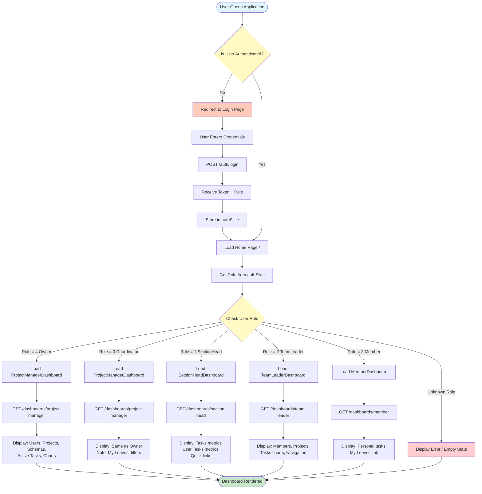
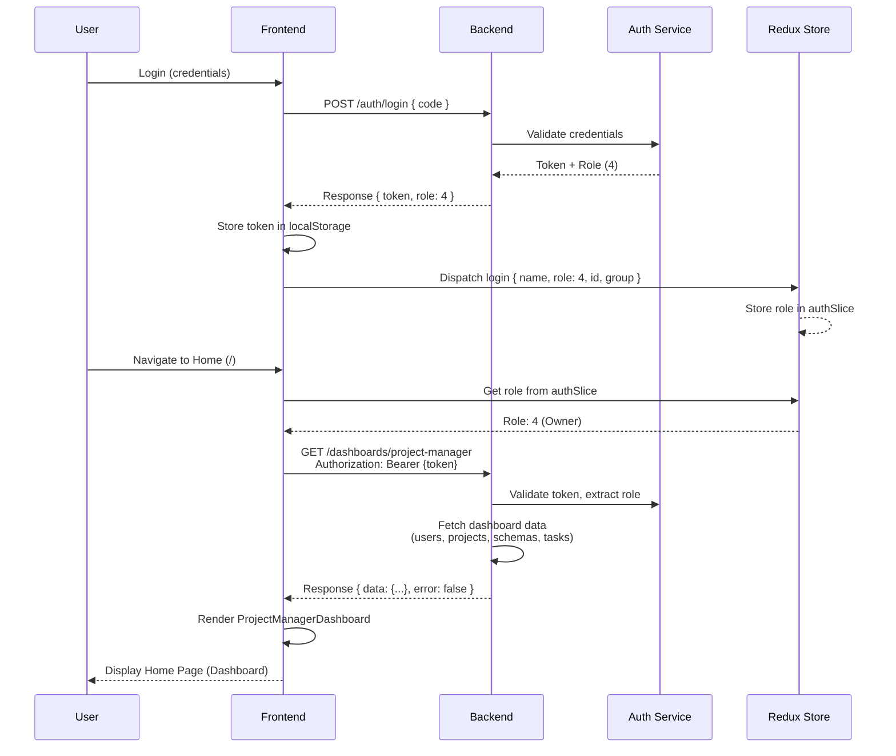
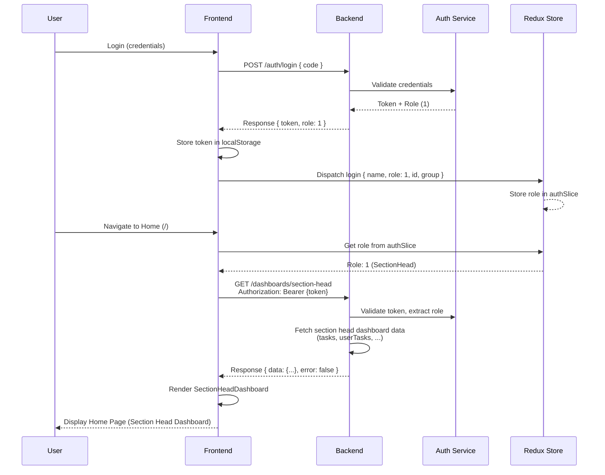
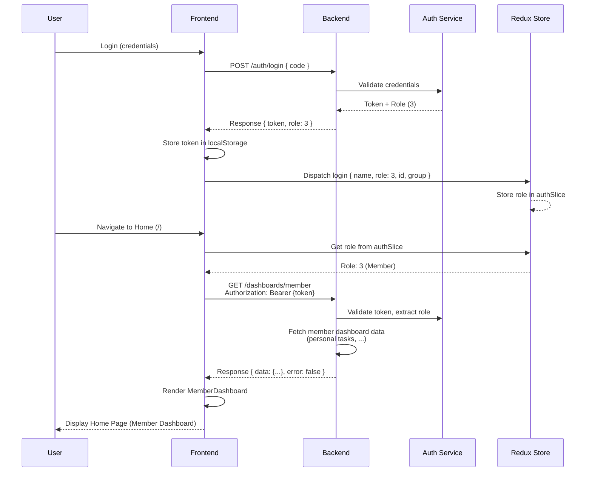
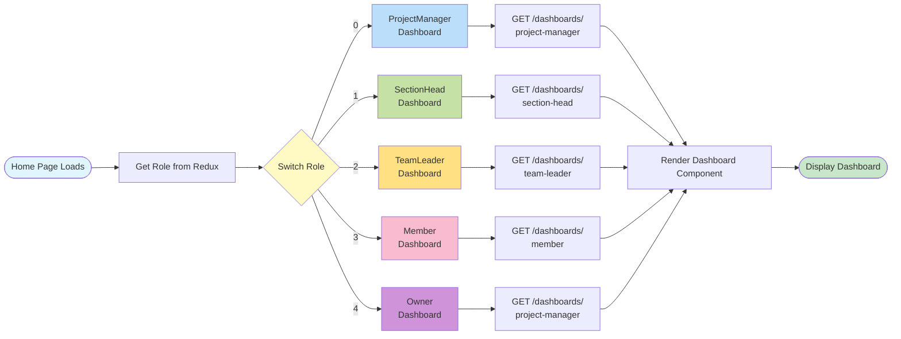
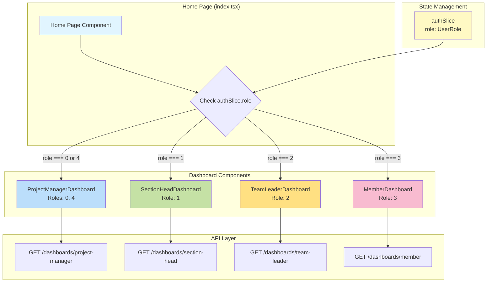
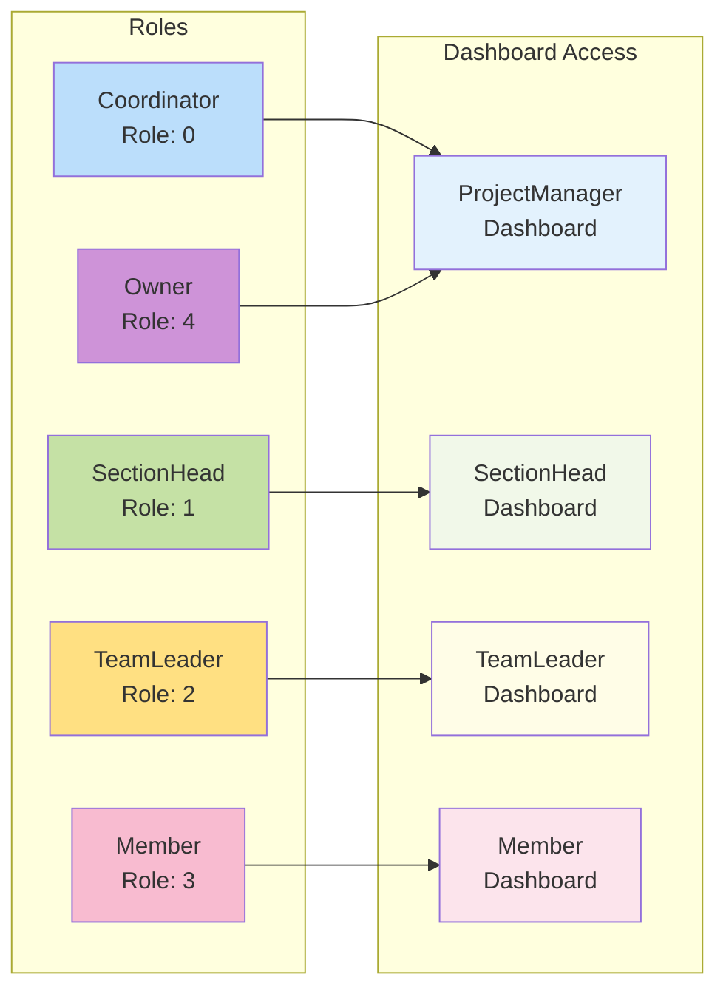

# Role-Based Home Page - Visual Diagrams

## User Flow Diagram (Mermaid)



## Sequence Flow Diagram - Owner Login (Mermaid)



## Sequence Flow Diagram - Section Head Login (Mermaid)



## Sequence Flow Diagram - Member Login (Mermaid)



## Role-Based Dashboard Selection Flow (Mermaid)



## Component Architecture Diagram (Mermaid)



## Role Permission Matrix (Mermaid)



---

## How to View These Diagrams

1. **VS Code:** Install the "Markdown Preview Mermaid Support" extension
2. **GitHub:** Diagrams will render automatically in markdown files
3. **Online:** Copy mermaid code to https://mermaid.live/
4. **Documentation Tools:** Most markdown renderers support Mermaid

---

## Text-Based Flow Diagrams

### User Flow (Simplified Text)

```
START
  ↓
User Opens App
  ↓
[Authenticated?]
  ├─ NO → Login → Store Token & Role → Continue
  └─ YES → Continue
  ↓
Load Home Page (/)
  ↓
Get Role from Redux Store
  ↓
[Role Check]
  ├─ 4 (Owner) → ProjectManagerDashboard → GET /dashboards/project-manager
  ├─ 0 (Coordinator) → ProjectManagerDashboard → GET /dashboards/project-manager
  ├─ 1 (SectionHead) → SectionHeadDashboard → GET /dashboards/section-head
  ├─ 2 (TeamLeader) → TeamLeaderDashboard → GET /dashboards/team-leader
  └─ 3 (Member) → MemberDashboard → GET /dashboards/member
  ↓
Render Dashboard Component
  ↓
Display Dashboard
  ↓
END
```

### Sequence Flow (Simplified Text)

```
User → Frontend: Login
Frontend → Backend: POST /auth/login
Backend → Auth: Validate
Auth → Backend: Token + Role
Backend → Frontend: Response { token, role }
Frontend → Redux: Store role
Frontend → Redux: Get role
Redux → Frontend: Role value
Frontend → Backend: GET /dashboards/{role-specific}
Backend → Frontend: Dashboard data
Frontend → User: Display dashboard
```

---

**Note:** These diagrams are complementary to the main sprint document and provide visual representations of the user flows and system interactions for the role-based home page feature.
