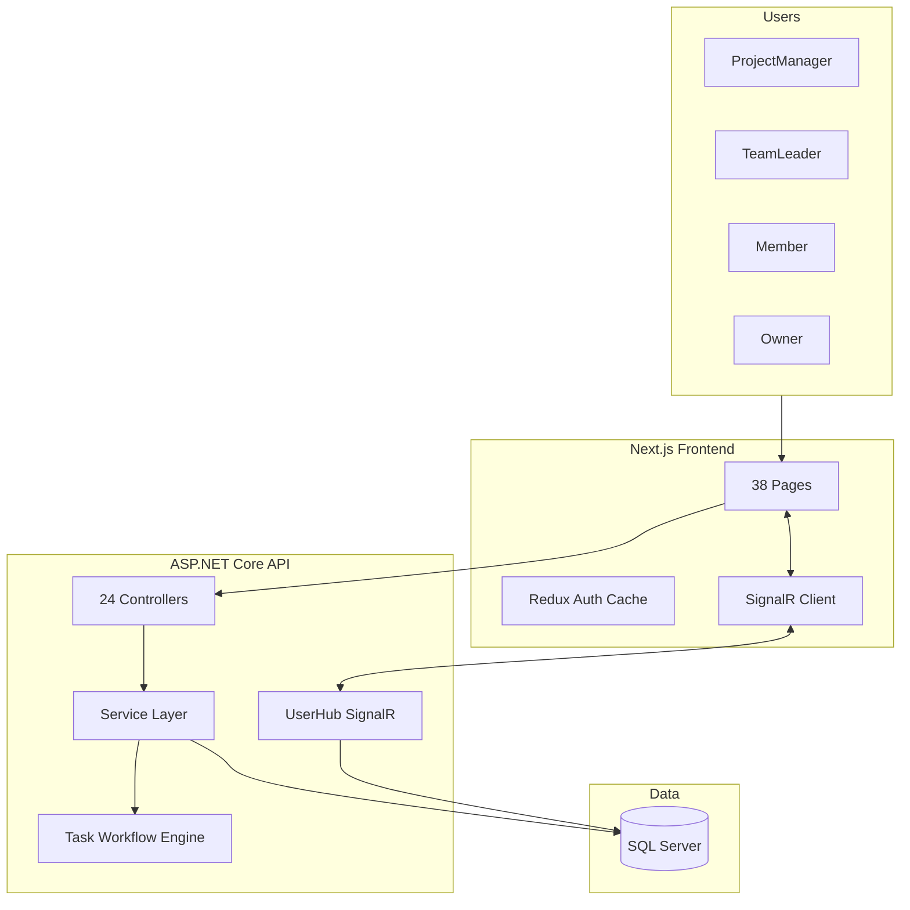
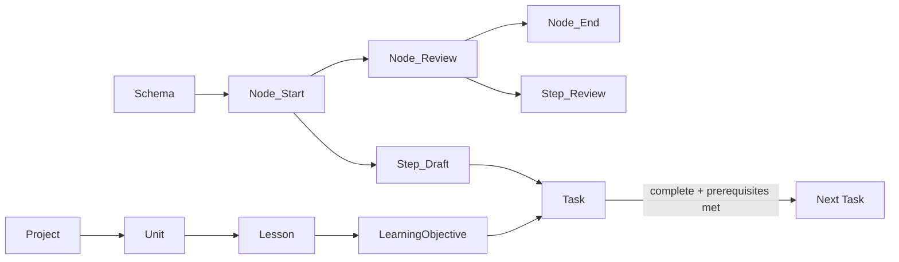

# How to Explain This Project (AI Prompt Kit)

## What this project is (one sentence)

**Automated Task System (ATS)** is an internal full-stack platform for **Selah El-Telmeez** that manages educational content production: curriculum projects flow through configurable workflow schemas, tasks are tracked on Kanban/sheet views, sprints organize delivery, and HR leave/permission workflows run alongside real-time notifications.

---

## Copy-paste AI prompt

Use this as a system or user prompt when you want an AI to explain, document, demo-script, or answer questions about the project:

```text
You are explaining the "Automated Task System" (ATS) — a full-stack internal task and curriculum workflow platform.

## Purpose
ATS automates how educational content teams produce curriculum. Instead of ad-hoc task tracking, teams define reusable workflow schemas (directed graphs of nodes and steps). When work starts on a learning objective, the system auto-generates tasks and moves them through the pipeline. Managers track progress via Kanban boards, spreadsheets, dashboards, and reports. HR features (leave, permissions, work-from-home) are integrated with role-based approval chains and real-time alerts.

## Repository structure
- Backend API: AutomatedTaskSystem/ — ASP.NET Core 10 Web API
- Frontend: AutomatedTaskSystem.UI/client/ — Next.js 13 (Pages Router), React 18, TypeScript
- Tests: AutomatedTaskSystem.Test/ — xUnit integration tests with in-memory DB
- ~38 frontend screens documented in FRONTEND_SCREENS_LIST.md

## Tech stack
Backend: .NET 10, EF Core 10, SQL Server, JWT auth + HTTP-only refresh cookies, SignalR (/userhub), Swagger, MailKit (email), Cronos (scheduled jobs), Dapper (reports)
Frontend: Next.js 13, Redux Toolkit, Tailwind + SCSS + MUI, Chart.js/Recharts, SignalR client, react-toastify
Auth: 6-character user code login → JWT access token (2 days) + refresh token cookie (10 days)

## Core domain model (explain top-down)
1. Organization: Users belong to Groups, Teams, and Sections. Five roles: Owner, ProjectManager, SectionHead, TeamLeader, Member.
2. Curriculum: Year → Project → Unit → Lesson → Learning Objective
3. Workflow engine: Schema → Nodes (ordered graph with Next/Previous) → Steps → Tasks
4. Execution: Tasks are created per learning objective per step; completing a step can spawn tasks in downstream nodes when prerequisites are met
5. Sprints: Time-boxed delivery windows linked to learning objectives
6. HR: Leave requests, permissions, work-from-home — multi-level approval with email + SignalR notifications

## Main features to highlight
- Configurable workflow schema designer (nodes/steps, archive, duplicate, task bank)
- Task lifecycle: assign, priority, pause, flag, comments, rollback, work-time tracking, jump/skip/proceed
- Dual views: Kanban board and spreadsheet per project/sprint/learning objective
- Role-based dashboards and sidebar navigation
- Project lifecycle: Active / On Hold / Closed
- Sprint planning and sprint analytics
- Resource management (users, groups, sections) for admins
- Calendar-based HR approvals with opinion/approval chains
- Real-time notifications via SignalR (task assignments, pending leave counts)
- Reporting: project overview, summaries, chart pages, SSRS advanced reports
- Background workers: monthly DB operations, leave balance resets

## Architecture pattern
Controllers → Services → EF Core DataContext → SQL Server
DTOs for API contracts; ResponseService<T> wrapper for consistent API responses
Frontend: pages/ (file-based routes) → components/pageComponent/ + lib/API/ (fetch to backend at localhost:5238)
Redux for auth + shared caches; local state + API calls on most pages; SignalR context for live toasts

## Key files (for technical depth)
- Backend entry: AutomatedTaskSystem/Program.cs
- DI wiring: AutomatedTaskSystem/Builder/DependancyInjections.cs
- DB context: AutomatedTaskSystem/Data/DataContext.cs
- Task engine: AutomatedTaskSystem/Services/Task/TaskService.cs
- Auth: AutomatedTaskSystem/Services/Auth/ (TokenService, AuthService)
- Real-time: AutomatedTaskSystem/Hub/UserHub.cs
- Frontend shell: AutomatedTaskSystem.UI/client/src/pages/_app.tsx
- Auth gate: AutomatedTaskSystem.UI/client/src/components/auth/
- API client: AutomatedTaskSystem.UI/client/src/lib/API/
- Sidebar/roles: AutomatedTaskSystem.UI/client/src/components/sidebar/sidebar.tsx

## What makes it distinctive (not a generic todo app)
- Graph-based workflow engine with node prerequisites (not just linear statuses)
- Tasks are tied to curriculum entities (learning objectives), not free-floating tickets
- Combines production workflow + sprint planning + HR in one system
- Role hierarchy drives both UI visibility and approval workflows
- Real-time layer for operational awareness (pending approvals, assignments)

## Demo narrative (5-minute walkthrough)
1. Login with 6-digit code → role-based home dashboard
2. Open a Project → see units/lessons/learning objectives
3. Open Tasks → Kanban board showing tasks per workflow step
4. Click a task → comments, step navigation, complete/proceed
5. Show Schemas → how workflows are designed as node graphs
6. Show Sprints → time-boxed delivery on learning objectives
7. Show Calendar → leave/permission approval flow
8. Mention notifications arriving live via SignalR

When explaining, match depth to audience:
- Non-technical: focus on problem, workflow automation, roles, dashboards
- Technical: focus on schema graph engine, service layer, JWT+SignalR, EF Core model
- Portfolio: emphasize full-stack scope, real-time, workflow engine, 38 screens, integration tests

Do not describe it as a simple task manager or Trello clone — emphasize curriculum workflow automation.
```

---

## Visual aids to include when explaining

### High-level system diagram



### Workflow engine (the differentiator)



Each **Learning Objective** gets tasks auto-generated from a **Schema**. **Nodes** form a directed graph; **Steps** within nodes define granular work. Completing tasks propagates work to **Next** nodes only when all **Previous** node requirements are satisfied (`AutomatedTaskSystem/Models/Node.cs`, `AutomatedTaskSystem/Services/Task/TaskService.cs`).

---

## Fact sheet (keep these numbers handy)

| Item | Value |
|------|-------|
| Backend controllers | 24 |
| Frontend screens | 38 |
| User roles | 5 (Owner, ProjectManager, SectionHead, TeamLeader, Member) |
| Core DB entities | ~30 DbSets |
| API docs | Swagger at `/swagger` |
| Real-time hub | `/userhub` |
| Dev ports | API `:5238`, UI `:3000` |

---

## Prompt variations (short add-ons)

Append one of these to the main prompt depending on what you need:

- **README generation:** "Write a professional README with setup instructions, architecture overview, and feature list. Backend runs via `dotnet run` in AutomatedTaskSystem; frontend via `npm run dev` in AutomatedTaskSystem.UI/client."
- **Interview prep:** "Prepare 10 likely interview questions and strong answers about architecture decisions, the workflow engine, auth, and real-time notifications."
- **Pitch deck script:** "Write a 2-minute spoken pitch for a non-technical manager, then a 5-minute technical deep-dive."
- **Onboarding doc:** "Write a day-1 developer guide: where to start reading code, how auth works, how a task moves through the system end-to-end."
- **Feature comparison:** "Compare ATS to Jira/Asana/Trello and explain why a custom workflow engine was needed for curriculum production."

---

## What NOT to say (common mistakes)

- Do not call it "just a task manager" — the schema graph + learning objective binding is the core value.
- Do not oversimplify auth as "password login" — it uses a **6-character user code** with JWT + refresh cookies.
- Do not ignore HR — leave/permission/WFH is a major module with approval chains, email, and SignalR.
- Do not claim every endpoint is `[Authorize]` — authorization is selective; mention role-based UI gating on the frontend.

---

## Quick usage

1. Open this file and copy the block inside the **Copy-paste AI prompt** section.
2. Paste it as a system prompt or at the start of a chat with any AI assistant.
3. Append one of the **Prompt variations** add-ons for your specific goal (README, interview prep, pitch, onboarding, comparison).
