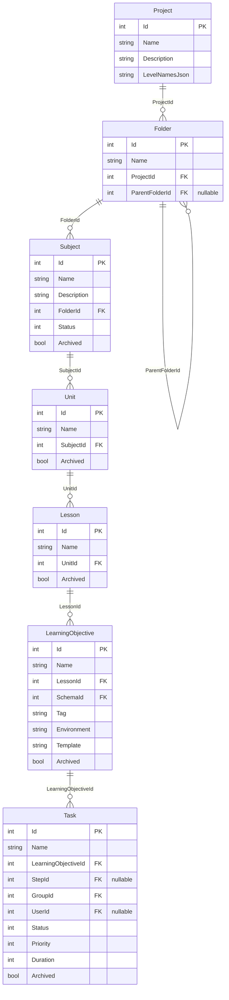
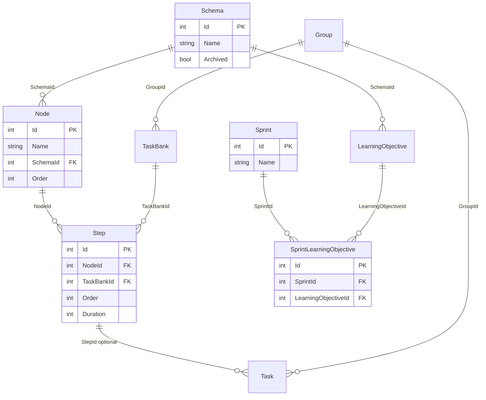

# Subject → Task Hierarchy ERD

Entity relationship diagram for the curriculum chain from **Subject** down to **Task**, based on the active models in `AutomatedTaskSystem/Models` and `DataContext`.

## Hierarchy chain

```
Project
  └── Folder (self-referencing tree via ParentFolderId)
        └── Subject
              └── Unit
                    └── Lesson
                          └── LearningObjective
                                └── Task
```

All solid parent → child links are **1:N**.

| Level | Entity | Table | Parent FK | Cardinality |
|------:|--------|-------|-----------|-------------|
| 0 | Project | `FolderProjects` | — | 1 Project → N Folders |
| 1 | Folder | `Folders` | `ProjectId`, `ParentFolderId?` | Folder → N children / N Subjects |
| 2 | Subject | `Subjects` | `FolderId` | 1 Subject → N Units |
| 3 | Unit | `Units` | `SubjectId` | 1 Unit → N Lessons |
| 4 | Lesson | `Lessons` | `UnitId` | 1 Lesson → N LearningObjectives |
| 5 | LearningObjective | `LearningObjectives` | `LessonId` | 1 LO → N Tasks |
| 6 | Task | `Tasks` | `LearningObjectiveId` | — |

## ERD (primary hierarchy)



## Related entities (not part of the subject tree)

These attach to the hierarchy but are not ancestors of Subject:



| Relationship | Type | Notes |
|--------------|------|-------|
| LearningObjective → Schema | N:1 | Workflow template applied to the LO |
| Schema → Node → Step | 1:N | Process definition |
| Task → Step | N:1 optional | Task instance of a workflow step |
| Sprint ↔ LearningObjective | N:M | Via `SprintLearningObjective` |
| Task → Group | N:1 | Work group assigned to the task |

## Model sources

| Entity | File |
|--------|------|
| Project | [`AutomatedTaskSystem/Models/Project.cs`](AutomatedTaskSystem/Models/Project.cs) |
| Folder | [`AutomatedTaskSystem/Models/Folder.cs`](AutomatedTaskSystem/Models/Folder.cs) |
| Subject | [`AutomatedTaskSystem/Models/Subject.cs`](AutomatedTaskSystem/Models/Subject.cs) |
| Unit | [`AutomatedTaskSystem/Models/Unit.cs`](AutomatedTaskSystem/Models/Unit.cs) |
| Lesson | [`AutomatedTaskSystem/Models/Lesson.cs`](AutomatedTaskSystem/Models/Lesson.cs) |
| LearningObjective | [`AutomatedTaskSystem/Models/LearningObjective.cs`](AutomatedTaskSystem/Models/LearningObjective.cs) |
| Task | [`AutomatedTaskSystem/Models/Task.cs`](AutomatedTaskSystem/Models/Task.cs) |

DbContext: [`AutomatedTaskSystem/Data/DataContext.cs`](AutomatedTaskSystem/Data/DataContext.cs)
