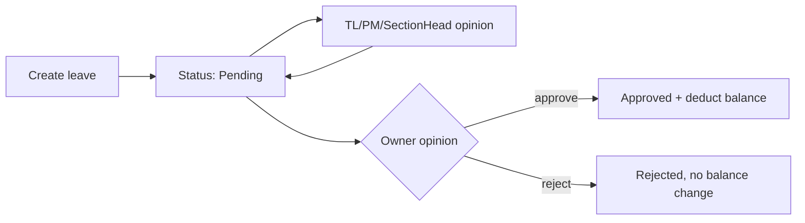
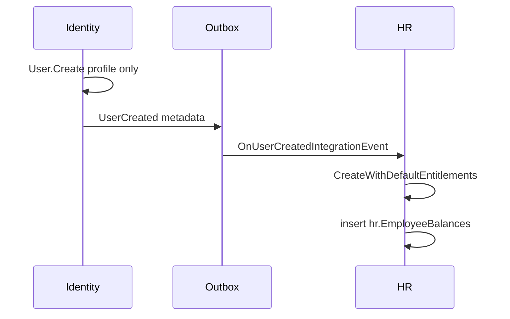

# TaskManagementSystem architecture


Living snapshot of the new solution. Update this file as the refactor grows.


**Last updated:** 2026-09-19


This is a **modular monolith** rewrite of the existing Automated Task System (ATS). Target framework is **.NET 10**. The old app under `../AutomatedTaskSystem` stays as the source of behavior until features are ported.


Solution file: [`TaskManagementSystem.slnx`](../TaskManagementSystem.slnx)


Related: [OTLP / OpenTelemetry](OTLP.md), [Database / DbUp](DATABASE.md)


## What is built today


The solution has **real cross-cutting infrastructure**, **Identity** (auth + RBAC admin), **Organization** (teams and sections CRUD), **Workflows** (schemas, nodes, ticket bank, steps), **Curriculum** (years through learning objectives, subject user assignment), **Ticket** (tickets, comments, work time), **Sprints** (planning + LO links), **Notifications** (inbox + realtime alerts), and the **complete HR slice** (leave, permissions, WFH, forgot clock, holidays).


| Layer | Status |

|---|---|

| Solution + 8 module projects | Done — Identity, HR, Organization, Workflows, Curriculum, Ticket, Sprints, Notifications implemented |

| BuildingBlocks (DDD + CQRS) | Done — domain primitives, MediatR pipeline |

| API host | Done — observability, realtime hub, JWT auth, Minimal API `/auth/*` endpoints |

| Identity module (auth + RBAC) | Done — login, refresh, logout, about-me; `/identity/*` permissions, roles, user role assignment |

| Organization module | Done — teams and sections CRUD with `SectionTeams` links |
| Workflows module | Done — schema types, schemas, nodes, ticket bank, steps CRUD |
| Curriculum module | Done — years, projects, terms, subject groups, subjects, units, lessons, learning objectives, subject user assignment |
| Ticket module | Done — create/get/list tickets, assign, proceed, complete, comments, work time, sprint-scoped ticket list |
| Sprints module | Done — CRUD, archive, LO assignment, list LOs |
| Notifications module | Done — inbox list/detail, mark read, `INotificationWriter` port for cross-module writes |

| HR module (leave complete) | Done — all leave types, opinions, from-next/preview, medical upload, search |
| HR module (permission + WFH) | Done — request, search, opinions, cancel, balance deduct/refund |
| HR module (forgot clock) | Done — request, search, opinions, cancel (no balance) |

| Persistence (DbUp + SQL scripts) | Done — per-module schemas, DatabaseMigrator, 22 migrations (000–010, 012–023; test/dev seed moved to `Scripts/Seeds/`) |

| EF Core / repositories | Done — Identity, HR, Organization, Workflows, Curriculum, Ticket, Sprints, and Notifications DbContexts + repositories |

| Frontend | In progress — Angular 22 at `D:\Full-Stack\frontend_refactor`; API mode default, permission-based menu, SignalR `/realtime`, `GET /tickets/stats` |

| Automated tests | Done — unit, integration, and architecture tests (Sprints + Notifications unit tests added) |


Suggested next slice: **Frontend** migration to direct JSON / ProblemDetails API.


## Authentication (Identity)


Modern HTTP API — direct JSON success bodies and RFC 7807 ProblemDetails errors (no `{ data, error, message }` envelope).


| Endpoint | Purpose | Success |
|---|---|---|
| `POST /auth/login` | `{ code }` → JWT + `refreshToken` HttpOnly cookie | 200 `{ accessToken }` |
| `POST /auth/refresh-token` | Rotate refresh token + new JWT | 200 `{ accessToken }` |
| `POST /auth/logout` | Invalidate refresh token | 204 No Content |
| `POST /auth/about-me` | Current user profile (`.RequireAuthorization()`) | 200 profile JSON |


- **Code-only login** — 6-character unique `Users.Code`, no password

- **JWT claims** — `"Id"`, `ClaimTypes.Role`, `ClaimTypes.NameIdentifier` (same as old ATS)

- **`about-me.group`** — team name from `organization.Teams`

- **Config** — `AppSetting:Token` signing key in `appsettings.json`

- **Auth at API boundary** — `.RequireAuthorization()` on minimal API routes; `ICurrentUserAccessor` reads JWT claims and passes explicit `UserId` into MediatR. Module handlers never use `IHttpContextAccessor`.

- **HTTP style** — auth routes are **Minimal API** in [`Endpoints/AuthEndpoints.cs`](../src/Api/TaskManagementSystem.Api/Endpoints/AuthEndpoints.cs). HR routes are grouped under [`Endpoints/HR/`](../src/Api/TaskManagementSystem.Api/Endpoints/HR/) (`Leave/`, `Holidays/`) with `MapHrEndpoints()` as the composition root.

- **Permission policies** — every route uses `.RequirePermissionCode(...)` with codes from the migration-seeded catalog (`PermissionCodes`). Policies are registered dynamically at startup; holding `{module}.manage` satisfies read/create/update/delete for that module prefix.

- **Endpoints map `Result<T>`** — handlers dispatch MediatR, then [`ResultHttpMapper`](../src/Api/TaskManagementSystem.Api/Infrastructure/ResultHttpMapper.cs) maps success to direct JSON (`Results.Ok`, `Results.NoContent`) and failures to ProblemDetails with `code` extension (`invalid_login_code` → 404, others → 400). No per-route try/catch.

- **Validation errors** — `ValidationBehavior` returns `Result.Fail` with `validation_failed` and a per-field `errors` map for `Result<T>` commands; [`ResultHttpMapper`](../src/Api/TaskManagementSystem.Api/Infrastructure/ResultHttpMapper.cs) emits them in ProblemDetails. Non-`Result` commands still throw `ValidationException`; [`ApiExceptionHandler`](../src/Api/TaskManagementSystem.Api/Infrastructure/ApiExceptionHandler.cs) groups failures the same way via a shared helper.

- **Unexpected errors** — `ApiExceptionHandler` returns 500 ProblemDetails (`code: unexpected_error`). Expected Identity failures return `Result<T>` instead of throwing.

- **RBAC admin** — `/identity/*` endpoints list the migration-seeded permission catalog, manage roles, assign permissions to roles, and administer users. Permission definitions are not created or modified via API (`019_identity_PermissionCatalog.sql`).

- **User admin (MVP)** — list/get/create/update/archive users with `TeamId` assignment; HR seeds `hr.EmployeeBalances` on create via `UserCreatedIntegrationEvent` (metadata-only payload; HR applies default entitlements). Permissions: `identity.users.read`, `identity.users.create`, `identity.users.update`, `identity.users.delete`, `identity.users.manage`.


## Identity user admin


| Endpoint | Purpose | Permission |
|---|---|---|
| `GET /identity/users` | List active users | `identity.users.read` |
| `GET /identity/users/{id}` | User detail | `identity.users.read` |
| `GET /identity/users/team-leaders` | TeamLeader + SectionHead lookup | `identity.users.read` |
| `POST /identity/users` | Create user (auto 6-char code) | `identity.users.create` |
| `PUT /identity/users/{id}` | Update profile, team, role | `identity.users.update` |
| `DELETE /identity/users/{id}` | Soft-archive user | `identity.users.delete` |
| `PUT /identity/users/{id}/role` | Assign role only | `identity.users.update` |

- **User aggregate** — Identity `User` maps auth/profile/team fields only (`Code`, `Name`, `HrCode`, `Email`, `Phone`, `Title`, `RoleId`, `AccountType`, `OnBoard`, `Archived`, `TeamId`). Team leader is **not** on the user; it lives on `organization.Teams.TeamleaderId` and is resolved in read queries / HR sync. Leave balances are **not** on the aggregate; Identity APIs never return balance fields.
- **Cross-schema validation** — `TeamId` validated via Dapper against `organization.Teams`; section-head check blocks archive.
- **HR sync (create)** — `User.NotifyCreated()` raises `UserCreatedDomainEvent` with metadata only (`UserId`, `TeamId`, `RoleId`). Outbox publishes `UserCreatedIntegrationEvent` with the same payload. HR `OnUserCreatedIntegrationEvent` resolves `TeamleaderId` from `organization.Teams`, then calls `EmployeeBalanceRecord.CreateWithDefaultEntitlements` and inserts `hr.EmployeeBalances`.
- **HR sync (update)** — `UserMetadataChangedIntegrationEvent` carries metadata only. HR `OnUserMetadataChangedIntegrationEvent` calls `SyncMetadata` on the existing row; if the row is missing (e.g. a missed create event), it self-heals by inserting via `CreateWithDefaultEntitlements`.
- **Default entitlements (HR-owned)** — used `0`, maxes **30 / 5 / 10 / 5** (annual / emergency / permission / WFH); sick and from-next counters `0`. Applied at create and on metadata self-heal — not copied from Identity.
- **Leave balances** — not on `identity.Users` (columns removed in migration `021`). Runtime balances live in `hr.EmployeeBalances` only.
- **Team leader** — not on `identity.Users` (column removed in migration `023`). Lives on `organization.Teams.TeamleaderId` only; HR search and user detail resolve it via join to Teams.
- **Deferred** — `UserChanges` audit trail.


## Organization (Teams + Sections)


Team-only org model: **Teams**, **Sections**, and **`SectionTeams`** join links. No org-level Groups.


| Endpoint | Purpose | Auth |
|---|---|---|
| `GET /organization/teams` | List active teams with member counts | Required |
| `GET /organization/teams/{id}` | Team detail with active members | Required |
| `POST /organization/teams` | Create team | Required |
| `PUT /organization/teams/{id}` | Update team name | Required |
| `DELETE /organization/teams/{id}` | Archive team | Required |
| `GET /organization/sections` | List active sections | Required |
| `GET /organization/sections/{id}` | Section detail with head and linked teams | Required |
| `POST /organization/sections` | Create section + team links | Required |
| `PUT /organization/sections/{id}` | Update section + replace team links | Required |
| `DELETE /organization/sections/{id}` | Archive section | Required |

- **Module layout** — [`TaskManagementSystem.Modules.Organization`](../src/Modules/Organization/TaskManagementSystem.Modules.Organization/) with `Domain/`, `Application/`, `Features/Teams/`, `Features/Sections/`, `Infrastructure/`.
- **Cross-schema reads** — member counts and section head validation use Dapper against `identity.Users` (modules do not reference each other).
- **HTTP style** — Minimal API in [`Endpoints/Organization/`](../src/Api/TaskManagementSystem.Api/Endpoints/Organization/OrganizationEndpoints.cs).


## Workflows (Schemas, Nodes, TicketBank, Steps)


Workflow definition MVP: **SchemaTypes**, **Schemas**, **Nodes** (ordered, start/end flags), **TicketBank** (team-scoped task templates), and **Steps** (node + ticket bank links). **NodeSequences** deferred.


| Endpoint | Purpose | Auth |
|---|---|---|
| `GET /workflows/schema-types` | List schema types | Required |
| `GET /workflows/schemas` | List active schemas | Required |
| `GET /workflows/schemas/{id}` | Schema detail | Required |
| `POST /workflows/schemas` | Create schema | Required |
| `PUT /workflows/schemas/{id}` | Update schema | Required |
| `DELETE /workflows/schemas/{id}` | Archive schema | Required |
| `GET /workflows/schemas/{schemaId}/nodes` | List nodes for schema | Required |
| `POST /workflows/schemas/{schemaId}/nodes` | Create node (auto order) | Required |
| `PUT /workflows/nodes/{id}` | Update node | Required |
| `DELETE /workflows/nodes/{id}` | Archive node | Required |
| `GET /workflows/ticket-bank` | List active ticket bank items | Required |
| `POST /workflows/ticket-bank` | Create ticket bank item | Required |
| `PUT /workflows/ticket-bank/{id}` | Update ticket bank item | Required |
| `DELETE /workflows/ticket-bank/{id}` | Deactivate ticket bank item | Required |
| `GET /workflows/nodes/{nodeId}/steps` | List steps for node | Required |
| `POST /workflows/nodes/{nodeId}/steps` | Create step (auto order) | Required |
| `PUT /workflows/steps/{id}` | Update step | Required |
| `DELETE /workflows/steps/{id}` | Archive step | Required |

- **Module layout** — [`TaskManagementSystem.Modules.Workflows`](../src/Modules/Workflows/TaskManagementSystem.Modules.Workflows/) with `Domain/`, `Application/`, `Features/`, `Infrastructure/`.
- **Cross-schema validation** — `TeamId` on TicketBank validated via Dapper against `organization.Teams` (no project references between modules).
- **HTTP style** — Minimal API in [`Endpoints/Workflows/`](../src/Api/TaskManagementSystem.Api/Endpoints/Workflows/WorkflowsEndpoints.cs).
- **Deferred** — NodeSequences / rollback graph rules from legacy ATS.


## Curriculum (Years, Projects, Terms, Subjects, LOs)


Curriculum definition MVP: **AcademicYears**, **CurriculumProjects**, **CurriculumTerms**, **SubjectGroups**, **Subjects** (with status), **Units**, **Lessons**, **LearningObjectives** (linked to workflow schemas), and **SubjectUser** assignments.


| Endpoint | Purpose | Auth |
|---|---|---|
| `GET /curriculum/years` | List active academic years | Required |
| `GET /curriculum/years/{id}` | Academic year detail | Required |
| `POST /curriculum/years` | Create academic year | Required |
| `PUT /curriculum/years/{id}` | Update academic year | Required |
| `DELETE /curriculum/years/{id}` | Archive academic year | Required |
| `GET /curriculum/years/{yearId}/tree` | Nested year tree (projects → terms → groups → subjects) | Required |
| `GET /curriculum/years/{yearId}/projects` | List projects for year | Required |
| `POST /curriculum/years/{yearId}/projects` | Create project | Required |
| `GET /curriculum/projects/{id}` | Project detail | Required |
| `PUT /curriculum/projects/{id}` | Update project | Required |
| `DELETE /curriculum/projects/{id}` | Archive project | Required |
| `GET /curriculum/projects/{projectId}/terms` | List terms for project | Required |
| `POST /curriculum/projects/{projectId}/terms` | Create term | Required |
| `GET /curriculum/terms/{id}` | Term detail | Required |
| `PUT /curriculum/terms/{id}` | Update term | Required |
| `DELETE /curriculum/terms/{id}` | Archive term | Required |
| `GET /curriculum/terms/{termId}/subject-groups` | List subject groups for term | Required |
| `POST /curriculum/terms/{termId}/subject-groups` | Create subject group | Required |
| `GET /curriculum/subject-groups/{id}` | Subject group detail | Required |
| `PUT /curriculum/subject-groups/{id}` | Update subject group | Required |
| `DELETE /curriculum/subject-groups/{id}` | Archive subject group | Required |
| `GET /curriculum/subject-groups/{subjectGroupId}/subjects` | List subjects for group | Required |
| `POST /curriculum/subject-groups/{subjectGroupId}/subjects` | Create subject | Required |
| `GET /curriculum/subjects/{id}` | Subject detail | Required |
| `PUT /curriculum/subjects/{id}` | Update subject | Required |
| `DELETE /curriculum/subjects/{id}` | Archive subject | Required |
| `PUT /curriculum/subjects/{id}/status` | Update subject status | Required |
| `GET /curriculum/subjects/{id}/users` | List assigned users | Required |
| `POST /curriculum/subjects/{id}/users` | Assign users to subject | Required |
| `POST /curriculum/subjects/{id}/users/unassign` | Unassign users from subject | Required |
| `GET /curriculum/subjects/{subjectId}/units` | List units for subject | Required |
| `POST /curriculum/subjects/{subjectId}/units` | Create unit | Required |
| `GET /curriculum/units/{id}` | Unit detail | Required |
| `PUT /curriculum/units/{id}` | Update unit | Required |
| `DELETE /curriculum/units/{id}` | Archive unit | Required |
| `GET /curriculum/units/{unitId}/lessons` | List lessons for unit | Required |
| `POST /curriculum/units/{unitId}/lessons` | Create lesson | Required |
| `GET /curriculum/lessons/{id}` | Lesson detail | Required |
| `PUT /curriculum/lessons/{id}` | Update lesson | Required |
| `DELETE /curriculum/lessons/{id}` | Archive lesson | Required |
| `GET /curriculum/lessons/{lessonId}/learning-objectives` | List LOs for lesson | Required |
| `POST /curriculum/lessons/{lessonId}/learning-objectives` | Create learning objective | Required |
| `GET /curriculum/learning-objectives/{id}` | Learning objective detail | Required |
| `PUT /curriculum/learning-objectives/{id}` | Update learning objective | Required |
| `DELETE /curriculum/learning-objectives/{id}` | Archive learning objective | Required |

- **Module layout** — [`TaskManagementSystem.Modules.Curriculum`](../src/Modules/Curriculum/TaskManagementSystem.Modules.Curriculum/) with `Domain/`, `Application/`, `Features/`, `Infrastructure/`.
- **Cross-schema validation** — `SchemaId` on LOs validated via Dapper against `workflows.Schemas`; user assignment validated against `identity.Users` (no project references between modules).
- **HTTP style** — Minimal API in [`Endpoints/Curriculum/`](../src/Api/TaskManagementSystem.Api/Endpoints/Curriculum/CurriculumEndpoints.cs).


## Ticket (Tasks, Comments, Work Time)


Ticket MVP: **Tickets** spawned from learning objectives + ticket bank workflow steps, **Comments**, and **TicketWorkTimes**. Rollback and TicketActivities audit remain deferred.


| Endpoint | Purpose | Auth |
|---|---|---|
| `POST /tickets` | Create ticket from LO + ticket bank item | Required |
| `GET /tickets/{id}` | Ticket detail | Required |
| `GET /subjects/{subjectId}/tickets` | List tickets for subject (Dapper curriculum join) | Required |
| `GET /learning-objectives/{loId}/tickets` | List tickets for learning objective | Required |
| `GET /sprints/{sprintId}/tickets` | List tickets linked via sprint LOs (Dapper sprints join) | Required |
| `PATCH /tickets/{id}/assign` | Assign user to ticket | Required |
| `PATCH /tickets/{id}/proceed` | Advance to next workflow step (or complete if last) | Required |
| `PATCH /tickets/{id}/complete` | Mark ticket completed | Required |
| `POST /tickets/{id}/comments` | Add comment (current user from JWT) | Required |
| `GET /tickets/{id}/comments` | List ticket comments | Required |
| `POST /tickets/{id}/work-times/start` | Start work time for current user | Required |
| `POST /tickets/{id}/work-times/stop` | Stop open work time for current user | Required |

- **Module layout** — [`TaskManagementSystem.Modules.Ticket`](../src/Modules/Ticket/TaskManagementSystem.Modules.Ticket/) with `Domain/`, `Application/`, `Features/`, `Infrastructure/`, `Contracts/TicketRealtime`.
- **Cross-schema validation** — LO, ticket bank, workflow steps, users, and teams validated via Dapper lookup ports (no module references).
- **Realtime** — mutating handlers publish `TicketRealtime.SilentUpdate` via `IRealtimePublisher` (BuildingBlocks port; no SignalR in module).
- **Notifications integration** — `TicketAssignedIntegrationEvent` / `TicketCompletedIntegrationEvent` written to `ticket.OutboxMessages`; `OutboxProcessor` dispatches to Notifications inbox handlers.
- **HTTP style** — Minimal API in [`Endpoints/Ticket/`](../src/Api/TaskManagementSystem.Api/Endpoints/Ticket/TicketEndpoints.cs).
- **Deferred** — Rollback, RollbackIssues, TicketActivities.


## Sprints (Planning)


Sprint planning: **Sprints** with date range and **SprintLearningObjectives** links to curriculum LOs.


| Endpoint | Purpose | Auth |
|---|---|---|
| `GET /sprints?archived=` | List sprints (default active only) | Required |
| `POST /sprints` | Create sprint | Required |
| `GET /sprints/{id}` | Sprint detail with linked LO ids | Required |
| `PUT /sprints/{id}` | Update sprint | Required |
| `DELETE /sprints/{id}` | Archive sprint | Required |
| `GET /sprints/{id}/learning-objectives` | List linked LO ids | Required |
| `POST /sprints/{id}/learning-objectives` | Add LO links (skip duplicates) | Required |
| `DELETE /sprints/{id}/learning-objectives/{loId}` | Remove LO link | Required |

- **Module layout** — [`TaskManagementSystem.Modules.Sprints`](../src/Modules/Sprints/TaskManagementSystem.Modules.Sprints/) with `Domain/`, `Application/`, `Features/`, `Infrastructure/`.
- **Cross-schema validation** — LO ids validated via Dapper against `curriculum.LearningObjectives`.
- **HTTP style** — Minimal API in [`Endpoints/Sprints/`](../src/Api/TaskManagementSystem.Api/Endpoints/Sprints/SprintsEndpoints.cs).


## Notifications (Inbox + Realtime)


User notifications: persisted inbox with visible realtime alerts (`notification.created`).


| Endpoint | Purpose | Auth |
|---|---|---|
| `GET /notifications?isRead=&page=&pageSize=` | List current user's notifications | Required |
| `GET /notifications/{id}` | Notification detail (current user only) | Required |
| `PATCH /notifications/{id}/read` | Mark one notification read | Required |
| `PATCH /notifications/read-all` | Mark all notifications read | Required |

- **Module layout** — [`TaskManagementSystem.Modules.Notifications`](../src/Modules/Notifications/TaskManagementSystem.Modules.Notifications/) with `Domain/`, `Application/`, `Features/`, `Infrastructure/`, `Contracts/NotificationRealtime`.
- **Cross-module writes** — integration events via outbox/inbox; consumer handlers in Notifications persist inbox rows and publish `NotificationRealtime.Visible`.
- **HTTP style** — Minimal API in [`Endpoints/Notifications/`](../src/Api/TaskManagementSystem.Api/Endpoints/Notifications/NotificationsEndpoints.cs).


## HR (Leave — complete slice)


Complete HR slice: **leave** (all types, from-next split/preview, sick medical upload), **permissions**, and **work from home**, with multi-level opinions (TL/PM/SectionHead record; Owner final approve/reject), role-scoped Dapper search, and shared balances. Email, SignalR notifications, and background jobs remain deferred.


| Endpoint | Purpose | Auth |
|---|---|---|
| `GET /hr/leave/balances` | Current user's leave balances (includes pending days in available) | Required |
| `GET /hr/leave/leave-settings` | Read-only leave windows (from-next, emergency blackout, reset) | Required |
| `POST /hr/leave/leave-requests/preview` | Preview annual from-next need before confirming | Required |
| `POST /hr/leave/leave-requests` | Create leave request (JSON or multipart for sick + medical cert) | Required |
| `GET /hr/leave/leave-requests` | List own leave requests | Required |
| `GET /hr/leave/leave-requests/search` | Role-scoped paginated list with filters | Required |
| `GET /hr/leave/leave-requests/pending` | Pending queue (Owner compat) | Owner |
| `GET /hr/leave/leave-requests/{id}` | Get leave request with opinions | Required / Owner |
| `GET /hr/leave/leave-requests/{id}/medical-certificate` | Download sick-leave medical certificate | Requester / Owner |
| `POST /hr/leave/leave-requests/{id}/opinions` | Record opinion or Owner approve/reject | TL+ / Owner |
| `POST /hr/leave/leave-requests/opinions/bulk` | Bulk Owner approve/reject | Owner |
| `PUT /hr/leave/leave-requests/{id}/cancel` | Cancel pending or future approved leave (type-aware refund) | Required |
| `POST /hr/leave/leave-requests/{id}/approve` | Owner approve alias → opinion approve | Owner |
| `GET /hr/holidays` | List public holidays (optional date filter) | Required |
| `POST /hr/holidays` | Create public holiday (single day or range) | ProjectManger+ |
| `PUT /hr/holidays/{id}` | Update public holiday | ProjectManger+ |
| `DELETE /hr/holidays/{id}` | Delete public holiday | ProjectManger+ |


## HR (Permissions)


| Endpoint | Purpose | Auth |
|---|---|---|
| `POST /hr/permissions` | Create permission request | Required |
| `GET /hr/permissions` | List own permission requests | Required |
| `GET /hr/permissions/search` | Role-scoped paginated list with filters | Required |
| `GET /hr/permissions/pending` | Pending queue | Owner |
| `GET /hr/permissions/{id}` | Get permission request with opinions | Required / Owner |
| `POST /hr/permissions/{id}/opinions` | Record opinion or Owner approve/reject | TL+ / Owner |
| `POST /hr/permissions/opinions/bulk` | Bulk Owner approve/reject | Owner |
| `PUT /hr/permissions/{id}/cancel` | Cancel pending or future approved permission (refund) | Required |
| `POST /hr/permissions/{id}/approve` | Owner approve alias | Owner |


## HR (Work From Home)


| Endpoint | Purpose | Auth |
|---|---|---|
| `POST /hr/work-from-home` | Create WFH request | Required |
| `GET /hr/work-from-home` | List own WFH requests | Required |
| `GET /hr/work-from-home/search` | Role-scoped paginated list with filters | Required |
| `GET /hr/work-from-home/pending` | Pending queue | Owner |
| `GET /hr/work-from-home/{id}` | Get WFH request with opinions | Required / Owner |
| `POST /hr/work-from-home/{id}/opinions` | Record opinion or Owner approve/reject | TL+ / Owner |
| `POST /hr/work-from-home/opinions/bulk` | Bulk Owner approve/reject | Owner |
| `PUT /hr/work-from-home/{id}/cancel` | Cancel pending or future approved WFH (refund) | Required |
| `POST /hr/work-from-home/{id}/approve` | Owner approve alias | Owner |


## HR (Forgot Clock)


| Endpoint | Purpose | Auth |
|---|---|---|
| `POST /hr/forgot-clock` | Create forgot clock in/out request | Required |
| `GET /hr/forgot-clock` | List own forgot clock requests | Required |
| `GET /hr/forgot-clock/search` | Role-scoped paginated list with filters | Required |
| `GET /hr/forgot-clock/pending` | Pending queue | Owner |
| `GET /hr/forgot-clock/{id}` | Get forgot clock request with opinions | Required / Owner |
| `POST /hr/forgot-clock/{id}/opinions` | Record opinion or Owner approve/reject | TL+ / Owner |
| `POST /hr/forgot-clock/opinions/bulk` | Bulk Owner approve/reject | Owner |
| `PUT /hr/forgot-clock/{id}/cancel` | Cancel pending or same-day approved request | Required |
| `POST /hr/forgot-clock/{id}/approve` | Owner approve alias | Owner |


### Opinions workflow




- **Owner + `IsApproved=true`** — approve and deduct balance by leave type; sick medical file deleted on approve
- **Owner + `IsApproved=false`** — reject (`Rejected`, no balance change)
- **TeamLeader / ProjectManger / SectionHead** — record opinion only; leave stays `Pending`
- **`POST .../approve`** — thin alias to Owner opinion approve (MVP compat)


- **Module layout** — [`TaskManagementSystem.Modules.HR`](../src/Modules/HR/TaskManagementSystem.Modules.HR/) follows the Identity vertical-slice template: `Domain/`, `Application/`, `Features/`, `Infrastructure/`. Features are grouped by submodule:
  - `Features/Leave/` — leave requests, opinions, preview, balances, medical certificate
  - `Features/Holidays/` — public holiday CRUD
  - `Features/Permissions/` — permission requests, opinions, search
  - `Features/WorkFromHome/` — WFH requests, opinions, search
  - `Features/ForgotClock/` — forgot clock in/out requests, opinions, search
- **Leave types** — Annual, Sick, Emergency, UnpaidLeave, FromNextBalance with type-specific balance rules
- **From-next split** — when annual exceeds available and user confirms, two `LeaveRequest` rows (Annual + FromNextBalance) in one transaction
- **Working days** — Friday and Saturday excluded, plus admin-managed public holidays from `hr.PublicHolidays` via [`IWorkingDayCalculator`](../src/Modules/HR/TaskManagementSystem.Modules.HR/Application/IWorkingDayCalculator.cs). `WorkingDays` is persisted on each leave request at creation time.
- **Public holidays** — Owner/ProjectManager manage holidays through `/hr/holidays`; excluded from leave preview, validation, split, and balance calculations
- **Leave settings** — `LeaveSettings` section in [`appsettings.json`](../src/Api/TaskManagementSystem.Api/appsettings.json); exposed via `GET /hr/leave/leave-settings`
- **Cross-schema reads** — Dapper query classes under `Infrastructure/Persistence/Queries/` using [`ISqlConnectionFactory`](../src/BuildingBlocks/TaskManagementSystem.BuildingBlocks/Application/Data/ISqlConnectionFactory.cs). Examples: About Me (identity + organization + notifications), leave search (hr + identity + organization), org section lookup for leave planning. Handlers call module UoW ports; Infrastructure runs the SQL. No foreign-schema EF `DbSet`s and no repositories for another module's tables.
- **Leave balances** — runtime source of truth is `hr.EmployeeBalances` (`EmployeeBalanceRecord`). HR reads/writes balances via EF in the same transaction as `hr.LeaveRequests`. New users get a row from `CreateWithDefaultEntitlements` on `UserCreatedIntegrationEvent`; leave approve/deduct/refund never touches Identity. HR does **not** reference the Identity or Organization projects.
- **DbContext mapping** — one `IEntityTypeConfiguration<>` per owned table under `Infrastructure/Persistence/Configurations/`; DbContext applies configurations from its assembly only. Map only columns owned by the module aggregate (e.g. Identity `User` maps auth/profile/team fields only). Leave balances exist only on `hr.EmployeeBalances` (legacy columns removed from `identity.Users` in migration `021`).
- **HTTP** — [`Endpoints/HR/`](../src/Api/TaskManagementSystem.Api/Endpoints/HR/) (`HrEndpoints.cs` composition root; one file per route under `Leave/` and `Holidays/`), contracts in [`Contracts/HR/`](../src/Api/TaskManagementSystem.Api/Contracts/HR/); error codes via [`ResultHttpMapper`](../src/Api/TaskManagementSystem.Api/Infrastructure/ResultHttpMapper.cs) (`leave_request_not_found`, `leave_medical_not_found`, `user_not_found` → 404; `leave_opinion_not_authorized` → 403)
- **OpenAPI (Apidog)** — HR + Auth spec at [`openapi/hr-openapi.json`](../src/Api/TaskManagementSystem.Api/openapi/hr-openapi.json); served at `GET /openapi/v1.json`. Import into Apidog via **Import → OpenAPI**. **Authenticate first:** run `POST /auth/login` with `{ "code": "TST001" }` (dev seed Owner), then set **Bearer {accessToken}** in Apidog before calling HR routes.
- **Integration tests** — seed data from [`002_IntegrationTestData.sql`](../src/Database/TaskManagementSystem.Database/Scripts/Seeds/002_IntegrationTestData.sql) via [`IntegrationTestDataSeeder`](../tests/TaskManagementSystem.TestCommon/Integration/IntegrationTestDataSeeder.cs) (runs after all migrations; includes guarded `hr.EmployeeBalances` for `TST001`)


### Module endpoint template (all future modules)

1. Dispatch MediatR command/query returning `Result<T>`
2. `return result.ToHttpResult(dto => Results.Ok(...))` or `Results.Created(...)` / `Results.NoContent()`
3. Never wrap in `{ data, error, message }`
4. Never catch expected failures — global exception handler covers validation and unexpected errors only

Contracts live under [`Contracts/{Module}/`](../src/Api/TaskManagementSystem.Api/Contracts/) (e.g. [`Contracts/Auth/`](../src/Api/TaskManagementSystem.Api/Contracts/Auth/)).


### Protected endpoint pattern

```csharp
group.MapPost("/about-me", AboutMeAsync).RequireAuthorization();

private static async Task<IResult> AboutMeAsync(
    IMediator mediator,
    ICurrentUserAccessor currentUser,
    CancellationToken ct)
{
    var userId = currentUser.GetRequiredUserId();
    var result = await mediator.Send(new AboutMeQuery(userId), ct);
    return result.ToHttpResult(profile => Results.Ok(new AuthInfoResponse { ... }));
}
```


### Frontend migration (deferred)

The Angular client in `TaskManagementSystem_Frontend` still expects the legacy envelope. When updating the frontend:

- Remove `ResponseService` / `toResult()` envelope parsing in `api-client.service.ts`
- Parse ProblemDetails `code` extension on HTTP errors (stop inferring codes from message text)
- Update MSW mocks in `identity.mock-handlers.ts` to return direct JSON on success and ProblemDetails on failure
- Expect `204` from logout instead of `{ error: false, message: "..." }`


## Layout


```

src/

  Api/TaskManagementSystem.Api              Thin host (SignalR + OpenTelemetry SDK + Minimal API endpoints)
    Endpoints/                              Route groups (e.g. AuthEndpoints)

  Database/
    DatabaseMigrator/                         DbUp console runner
    TaskManagementSystem.Database/            SQL scripts + Structure per schema

  BuildingBlocks/TaskManagementSystem.BuildingBlocks

    Domain/                                   Entity, ValueObject, rules, domain events

    Application/                              ICommand/IQuery, MediatR behaviors, AddBuildingBlocks

    Infrastructure/Realtime/                  IRealtimePublisher port

    Infrastructure/Observability/             Telemetry names (BCL only)

  Modules/<Name>/TaskManagementSystem.Modules.<Name>

    Domain/                                   (empty — placeholders)

    Features/                                 (empty — vertical slice folders)

    Infrastructure/                           (empty)

    Contracts/                                Realtime factories where defined

tests/

  TaskManagementSystem.TestCommon             Shared builders, MediatR samples, WebApplicationFactory

  TaskManagementSystem.BuildingBlocks.UnitTests

  TaskManagementSystem.Modules.UnitTests

  TaskManagementSystem.Api.IntegrationTests

  TaskManagementSystem.ArchitectureTests

docs/

  ARCHITECTURE.md                             This file

  OTLP.md                                     OpenTelemetry export details

```


The API references every module. Each module references BuildingBlocks only. **Modules do not reference each other.**


```

API

 ├── Identity, Organization, Workflows

 ├── Curriculum, Ticket, Sprints

 ├── Notifications, HR

 └── BuildingBlocks (via modules and a direct reference)


Each module --> BuildingBlocks

```


## API host


[`Program.cs`](../src/Api/TaskManagementSystem.Api/Program.cs) wires three concerns:


```csharp

builder.AddObservability();                  // traces, metrics, logs (OTLP optional; see docs/OTLP.md)

builder.Services.AddBuildingBlocks(

    typeof(Program).Assembly,

    typeof(Entity).Assembly);                // MediatR + pipeline behaviors

builder.Services.AddRealtime();              // SignalR hub + IRealtimePublisher adapter


app.MapAuthEndpoints();                      // POST /auth/login, /auth/about-me, etc.
app.MapRealtimeHub();                        // single WebSocket at /realtime

```


`public partial class Program;` is exposed for `WebApplicationFactory` integration tests.


Auth is exposed via **Minimal API** at `/auth/*` ([`AuthEndpoints.cs`](../src/Api/TaskManagementSystem.Api/Endpoints/AuthEndpoints.cs)). Other product HTTP endpoints are not ported yet.

**Local observability** — run `docker compose -f docker-compose.observability.yml up -d`, then start the API in Development. Open http://localhost:18888 (Aspire dashboard). OTLP export, validation/unhandled-exception logging, and MediatR tracing are documented in [OTLP.md](OTLP.md).


## BuildingBlocks


Shared kernel used by every module. Third-party packages allowed here: **MediatR**, **FluentValidation**. No SignalR or OpenTelemetry packages.


### Domain (`Domain/`)


| Type | Role |

|---|---|

| `Entity` | Identity equality, `DomainEvents` list, `CheckRule(IBusinessRule)` |

| `ValueObject` | Component-based equality via `GetEqualityComponents()` |

| `IAggregateRoot` | Marker for aggregate roots |

| `IBusinessRule` | `IsBroken()`, `Message` |

| `BusinessRuleValidationException` | Thrown when `Entity.CheckRule` finds a broken rule |

| `IDomainEvent` / `DomainEventBase` | `Id`, `OccurredOn` on every domain event |
| `IResult` / `Result<T>` / `ResultError` / `NoValue` | Discriminated union for expected failures; `ResultError` may carry optional `ValidationErrors` (`property → messages[]`); static `Result.Ok()` / `Result.Fail<T>()` factories |


**Expected application failures** (invalid login code, expired refresh token, archived user, FluentValidation on `Result<T>` commands) return `Result<T>` from handlers — they do not throw. **HTTP status codes are mapped at the API boundary** from error codes (e.g. `invalid_login_code` → 404, `validation_failed` → 400); `ResultError` carries only `Code` and `Message`.


### Application (`Application/`)


| Type | Role |

|---|---|

| `ICommand` / `ICommand<TResult>` | MediatR `IRequest` markers for writes |

| `IQuery<TResult>` | MediatR `IRequest<TResult>` marker for reads |

| `IIntegrationEvent` | Cross-module event contract (`TaskManagementSystem.IntegrationEvents`); extends MediatR `INotification` |
| `IOutboxWriter` / `IInboxGuard` | Outbox/inbox ports for reliable cross-module delivery |
| `IDomainEventDispatcher` | Dispatches aggregate domain events before/after `SaveChanges` via `UnitOfWork.CommitAsync` |

| `IUnitOfWork` | `CommitAsync` port; EF modules implement via `EfUnitOfWork<TContext>` in BuildingBlocks.Persistence |

| `LoggingBehavior` | Logs request name + success/failure via `ILogger` (includes trace/kind/module scope) |
| `TracingBehavior` | OpenTelemetry spans + metrics for every command/query via `Telemetry.Mediator` |
| `AuditBehavior` | Persists command audit rows (`app.AuditLog`) — commands only; uses `IResult.IsSuccess` when handler returns `Result<T>` |
| `ValidationBehavior` | Runs FluentValidation validators; returns `Result.Fail(validation_failed)` with grouped property errors for `Result<T>` commands, throws for others |
| `TicketTransactionBehavior` / `HrTransactionBehavior` | Per-module DB transactions for commands marked `ITicketCommand` / `IHrCommand` |

| `AddBuildingBlocks(assemblies…)` | Registers MediatR, both pipeline behaviors, and validators |


Commands and queries are dispatched through MediatR. Module handlers will implement `IRequestHandler<>` in `Features/` slices when product logic is ported.

### Persistence (EF Core)

| Type | Location | Role |
|---|---|---|
| `GenericRepository<TEntity, TContext>` | `BuildingBlocks.Persistence` | Shared read/write EF helpers (`FindReadOnlyAsync`, `FindTrackedAsync`, `AddEntityAsync`, `ExistsReadOnlyAsync`) |
| `EfUnitOfWork<TContext>` | `BuildingBlocks.Persistence` | `IUnitOfWork` over `SaveChangesAsync`; exposes protected `DbContext` |
| `LazyRepositoryFactory` | `BuildingBlocks.Persistence` | `Lazy<T>` with `ExecutionAndPublication` for repo properties on module UoW |
| Module UoW | `Modules.{Name}.Application` | e.g. `IIdentityUnitOfWork` — **sole handler entry point** for repositories |
| Narrow repository ports | `Modules.{Name}.Application` | Use-case methods only (`IUserRepository`, `IAboutMeRepository`) — not registered individually in DI |
| Repository implementations | `Modules.{Name}.Infrastructure/Persistence` | Extend `GenericRepository`; wired lazily inside module UoW |

Handlers inject **`IIdentityUnitOfWork`** (or future `IOrganizationUnitOfWork`) — not individual repositories or `DbContext`. Commands call `unitOfWork.{Repo}` then `unitOfWork.CommitAsync()`. Queries call read repositories on the same UoW without commit.

**Identity example:**

```csharp
public interface IIdentityUnitOfWork : IUnitOfWork
{
    IUserRepository Users { get; }
    IRefreshTokenRepository RefreshTokens { get; }
    IAboutMeRepository AboutMe { get; }
}
```

Cross-schema reads use Dapper query classes (`Infrastructure/Persistence/Queries/`) behind UoW repositories (e.g. `IAboutMeRepository`, `ILeaveRequestRepository.SearchAsync`). Owned-table reads/writes stay on EF via the module DbContext.

**Future module template (e.g. Organization Teams/Sections):**

```
Application/IOrganizationUnitOfWork.cs     // extends IUnitOfWork, exposes ITeamRepository Teams { get; }
Application/ITeamRepository.cs             // use-case methods
Infrastructure/OrganizationUnitOfWork.cs   // Lazy repo properties, single DbContext
Infrastructure/TeamRepository.cs           // extends GenericRepository<Team, OrganizationDbContext>
```

No generic `Update`/`Delete` on repositories — load tracked entities, mutate via domain methods, then `CommitAsync`.

### Command audit log

| Piece | Location | Notes |
|---|---|---|
| `IAuditContext` | `BuildingBlocks.Application` | `UserId` + `CorrelationId` ports |
| `AuditContext` | `Api/Infrastructure` | Reads JWT `"Id"` claim + `Activity.Current.TraceId` |
| `IAuditStore` / `AuditEntry` | `BuildingBlocks.Application` | Append-only audit port |
| `EfAuditStore` / `AuditDbContext` | `BuildingBlocks.Persistence/Audit` | Maps to `app.AuditLog` |
| `AuditBehavior` | MediatR pipeline | Commands only; stores action name, not payload |

Migration: `012_app_AuditLog.sql`. Queries are traced/logged but not audited.


### Infrastructure ports


| Port | Location | Implementation |

|---|---|---|

| `IRealtimePublisher` | `Infrastructure/Realtime/` | `SignalRRealtimePublisher` in API |

| `Telemetry` (ActivitySource/Meter names) | `Infrastructure/Observability/` | BCL only; SDK wired in API |


## Module folders


Every module uses the same shape:


| Folder | Role |

|---|---|

| `Domain/` | Aggregates, value objects, business rules |

| `Features/` | Vertical slices grouped by submodule (`Leave/`, `Holidays/`); one folder per use case inside each group |

| `Infrastructure/` | Persistence, module composition root |

| `Contracts/` | Public facade, integration events, realtime message factories |


### Modules and feature slices


| Module | Planned slices | Code today |

|---|---|---|

| Identity | Authenticate, RefreshToken, AboutMe, Logout, RBAC admin | Done — auth + `/identity/*` RBAC |

| Organization | **Teams**, **Sections** (no Groups) | Done — teams/sections CRUD + `SectionTeams` |

| Workflows | Schemas, Nodes, Steps, TicketBank | Done |

| Curriculum | Projects, Subjects, Units, Lessons, LearningObjectives | Done |

| Ticket | Tickets, Comments, Rollback, WorkTime | Done — `Contracts/TicketRealtime` (silent sync) |

| Sprints | Sprints, SprintLearningObjectives | Done |

| Notifications | Notifications (visible alerts only) | Done — `Contracts/NotificationRealtime` + `INotificationWriter` |

| HR | Leave, Permissions, WorkFromHome, ForgotClock, Holidays | Done — email/SignalR/annual reset job deferred |


Organization is **team-only** at the org-unit level: use Teams and Sections. Do not reintroduce Groups as an org concept. SignalR `JoinGroup` is a **connection group**, not an org Group.


The task execution module is named **Ticket** (not Task) to avoid clashing with `System.Threading.Tasks.Task`.


## Rules


- Domain modules must not reference **SignalR** or **OpenTelemetry** packages.

- The API is the only place that hosts SignalR (`RealtimeHub`) and the OpenTelemetry SDK.

- Notifications must not depend on Ticket types. Silent ticket payloads stay in Ticket contracts.

- Architecture tests in `tests/TaskManagementSystem.ArchitectureTests` enforce these boundaries.


## Realtime


One WebSocket: **`/realtime`**.


| Kind | Meaning | Example |

|---|---|---|

| Silent | Patch UI with no toast/inbox | `ticket.updated` via `TicketRealtime.SilentUpdate()` |

| Notification | User should notice (toast, badge, inbox) | `notification.created` via `NotificationRealtime.Visible()` |


**Port:** `IRealtimePublisher` in BuildingBlocks (`PublishToUserAsync` / `PublishToGroupAsync`).


**Adapter:** `SignalRRealtimePublisher` in the API injects `IHubContext<RealtimeHub>`.


**Hub:** `RealtimeHub` exposes `JoinGroup` / `LeaveGroup` for connection groups.


Domain code injects `IRealtimePublisher`, never `IHubContext`. Silent content sync does **not** go through the Notifications module.


## Integration events (outbox/inbox)


Cross-module side effects use the kgrzybek-style transactional outbox:


1. Aggregate raises a **domain event** (`TicketAssignedDomainEvent`, `UserCreatedDomainEvent`, …).
2. `UnitOfWork.CommitAsync` dispatches domain events via `IDomainEventDispatcher`, then `SaveChanges`.
3. Domain-event handlers map to **`IIntegrationEvent`** records (in [`TaskManagementSystem.IntegrationEvents`](../src/BuildingBlocks/TaskManagementSystem.IntegrationEvents/)) and append rows to the publisher module's `{schema}.OutboxMessages` in the same transaction.
4. **`OutboxProcessor`** (hosted service per publishing schema: `ticket`, `identity`) polls `{schema}.OutboxMessages` and delegates batch processing to **`IOutboxPump`**, which deserializes events and publishes via `IIntegrationEventBus` (in-process MediatR).
5. Consumer modules use **`IInboxGuard`** to deduplicate by `(IntegrationEventId, ConsumerName)`, then persist business data + inbox row in one commit.

**Integration tests:** `WebApplicationFactory` does not reliably run background services, so tests call **`TmsWebApplicationFactory.DrainOutboxesAsync()`** (via [`IntegrationOutboxSupport`](../tests/TaskManagementSystem.TestCommon/Integration/IntegrationOutboxSupport.cs)) when asserting cross-module side effects such as notifications.


**Live slices:**

| Publisher | Event | Payload | Consumer | Effect |
|---|---|---|---|---|
| Ticket | `TicketAssignedIntegrationEvent` | Ticket id, assignee, … | Notifications | Inbox row + visible realtime |
| Ticket | `TicketCompletedIntegrationEvent` | Ticket id, … | Notifications | Inbox row + visible realtime |
| Identity | `UserCreatedIntegrationEvent` | `UserId`, `TeamId`, `RoleId` | HR | `OnUserCreated` → resolve team leader from `organization.Teams` → `CreateWithDefaultEntitlements` → insert `hr.EmployeeBalances` |
| Identity | `UserMetadataChangedIntegrationEvent` | `UserId`, `TeamId`, `RoleId` | HR | `OnUserMetadataChanged` → resolve team leader from `organization.Teams` → `SyncMetadata`; if row missing, `CreateWithDefaultEntitlements` (self-heal) |

**Identity → HR balance flow (create):**



**Default entitlements** (HR domain factory, not on the integration event): used counters `0`; maxes annual **30**, emergency **5**, permission **10**, WFH **5**; sick / from-next / old-annual **0**.

**Removed:** direct `INotificationWriter` port, Dapper `EmployeeBalanceCommands` cross-schema writes, and leave fields on Identity `User` / `UserCreatedIntegrationEvent`.


**Transaction markers:** Ticket commands implement `ITicketCommand`; HR bulk opinion commands implement `IHrCommand`. Module-specific `TransactionBehavior` wraps them in a single DB transaction.


## Observability


Traces, metrics, and logs are configured on the host via `AddObservability()`. Module code uses BCL `ActivitySource` / `Meter` / `ILogger` from `Telemetry` in BuildingBlocks. Export is OTLP when an endpoint is set. See [OTLP.md](OTLP.md).


## Testing


Automated tests cover unit, integration, and architecture boundaries. Unit and architecture tests pass without SQL Server; integration tests require a reachable SQL Server instance (`localhost` by default in [`TmsWebApplicationFactory`](../tests/TaskManagementSystem.TestCommon/Integration/TmsWebApplicationFactory.cs)). Shared packages and versions live in [`tests/Directory.Build.props`](../tests/Directory.Build.props).


| Project | Type | Tests | Scope |

|---|---|---|---|

| `BuildingBlocks.UnitTests` | Unit | 45+ | Entity rules/events, ValueObject equality, pipeline behaviors, `OutboxPump`, `AddBuildingBlocks` DI, `SqlScriptSeeder` |

| `Modules.UnitTests` | Unit | 2 | `TicketRealtime`, `NotificationRealtime` contract factories |

| `Modules.Identity.UnitTests` | Unit | 15 | Auth handlers, JWT, validators |

| `Modules.HR.UnitTests` | Unit | 47 | Working days, holidays, leave types, settings, opinions, handlers, validators |

| `Modules.Organization.UnitTests` | Unit | 7 | Team/section domain rules and create-team handler |

| `Modules.Workflows.UnitTests` | Unit | 8 | Schema, node, ticket bank, step domain and handlers |

| `Modules.Curriculum.UnitTests` | Unit | 9 | Curriculum domain rules and handlers |

| `Modules.Ticket.UnitTests` | Unit | 6 | Ticket domain rules and handlers |

| `Modules.Sprints.UnitTests` | Unit | 4 | Sprint domain rules and handlers |

| `Modules.Notifications.UnitTests` | Unit | 2 | Notification domain rules and handlers |

| `Api.IntegrationTests` | Integration | 49 | Auth, RBAC, HR, Organization, Workflows, Curriculum, Ticket, Sprints, Notifications, audit, SignalR hub |

| `ArchitectureTests` | Architecture | 11 | SignalR/OpenTelemetry boundaries, Notifications↛Ticket, hub location |

| `TestCommon` | Shared | — | Bogus builders, sample MediatR commands, `TmsWebApplicationFactory` (isolated `TmsTests_*` DB per fixture, dropped on dispose), `IntegrationHttpAssertions`, `IntegrationOutboxSupport` |


**Stack:** xUnit, FluentAssertions, NSubstitute, Bogus, `Microsoft.AspNetCore.Mvc.Testing`, `Microsoft.AspNetCore.SignalR.Client`.


**Naming:** `Method_Scenario_ExpectedResult`.


**TestCommon builders:** `TicketPayloadBuilder`, `NotificationPayloadBuilder`, `RealtimeMessageBuilder`.


**TestCommon MediatR samples:** `PingCommand`, `ValidatedCommand` (+ validator), `FailingCommand` — used by integration tests to prove the pipeline.


**Run all tests:**


```powershell

dotnet test TaskManagementSystem.slnx -p:UseAppHost=false

```

Integration tests on Windows may require `-p:UseAppHost=false` (NETSDK1029). Targeted smoke for the seed/outbox fixes:

```powershell
dotnet test tests/TaskManagementSystem.Api.IntegrationTests `
  --filter "FullyQualifiedName~AssignTicket_WritesNotificationViaOutbox|FullyQualifiedName~SprintsAndNotificationsFlow" `
  -p:UseAppHost=false
```


### Future module test pattern


When a module gains domain logic and handlers:


1. Add `TaskManagementSystem.Modules.{Name}.UnitTests` — domain rules + handlers with mocked `IUnitOfWork`/repos.

2. Optionally add `{Name}.IntegrationTests` — EF InMemory or Testcontainers, module composition root.

3. Reuse `TestCommon` builders; extend `TmsWebApplicationFactory` to register the module.


## Status summary


### Implemented


- Solution structure: API, BuildingBlocks, 8 modules

- DDD domain primitives (`Entity`, `ValueObject`, business rules, domain events)

- CQRS markers and MediatR pipeline (logging + FluentValidation)

- `AddBuildingBlocks()` host registration

- Realtime port/adapter (`IRealtimePublisher` → SignalR hub at `/realtime`)

- Ticket and Notifications realtime contract factories

- OpenTelemetry host pipeline (OTLP export optional)

- Realtime silent board updates from Ticket mutating handlers

- Architecture boundary tests

- Full testing foundation (unit + integration + shared TestCommon)

- DbUp database layer: per-module SQL schemas, `DatabaseMigrator` (+ `--seed` mode), 20 migrations, separate integration seed script (`002_IntegrationTestData.sql`)

- Identity auth: code-only login, JWT + refresh cookies, `/auth/*` + `/identity/*` RBAC admin

- Organization: teams and sections CRUD with `OrganizationDbContext`

- HR: leave, permissions, WFH, forgot clock, holidays — full HTTP API under `/hr/*`


### Not built yet


- Identity `UserChanges` audit

- Module facades (`ITicketModule.ExecuteCommandAsync`, etc.)

- Port of ATS product behavior (~25 controllers, workflow engine)

- Frontend


## How to update this doc


When you add a module, slice, or cross-cutting rule:


1. Update the module table, **What is built today**, or **Status summary**.

2. Set **Last updated**.

3. If the change is observability/OTLP, edit [OTLP.md](OTLP.md) instead of duplicating it here.


