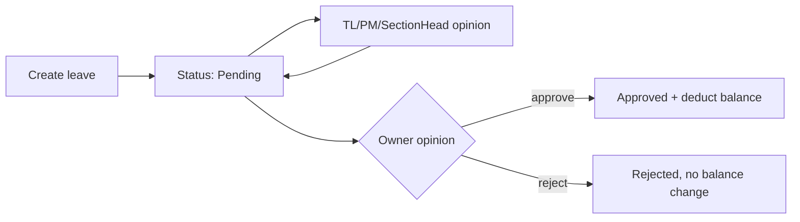

# TaskManagementSystem architecture


Living snapshot of the new solution. Update this file as the refactor grows.


**Last updated:** 2026-09-07


This is a **modular monolith** rewrite of the existing Automated Task System (ATS). Target framework is **.NET 10**. The old app under `../AutomatedTaskSystem` stays as the source of behavior until features are ported.


Solution file: [`TaskManagementSystem.slnx`](../TaskManagementSystem.slnx)


Related: [OTLP / OpenTelemetry](OTLP.md), [Database / DbUp](DATABASE.md)


## What is built today


The solution has **real cross-cutting infrastructure**, the **Identity auth slice** (code-only login), and the **HR leave complete slice** (all leave types, opinions, from-next, medical upload, role-scoped search). Other product features (tickets, etc.) are not ported yet.


| Layer | Status |

|---|---|

| Solution + 8 module projects | Done — folder structure only |

| BuildingBlocks (DDD + CQRS) | Done — domain primitives, MediatR pipeline |

| API host | Done — observability, realtime hub, JWT auth, Minimal API `/auth/*` endpoints |

| Identity module (auth) | Done — login, refresh, logout, about-me (modern HTTP API) |

| HR module (leave complete) | Done — all leave types, opinions, from-next/preview, medical upload, search |

| Other module business logic | Not started |

| Persistence (DbUp + SQL scripts) | Done — per-module schemas, DatabaseMigrator, initial DDL |

| EF Core / repositories | Done — Identity `IdentityDbContext`, HR `HrDbContext` + repositories |

| Frontend | Not started |

| Automated tests | Done — 105 tests across unit, integration, and architecture |


Suggested next slice: **Organization** (Teams/Sections CRUD) or **Ticket** execution.


## Authentication (Identity)


Modern HTTP API — direct JSON success bodies and RFC 7807 ProblemDetails errors (no `{ data, error, message }` envelope).


| Endpoint | Purpose | Success |
|---|---|---|
| `POST /auth/login` | `{ code }` → JWT + `refreshToken` HttpOnly cookie | 200 `{ accessToken }` |
| `POST /auth/refresh-token` | Rotate refresh token + new JWT | 200 `{ accessToken }` |
| `POST /auth/logout` | Invalidate refresh token | 204 No Content |
| `POST /auth/about-me` | Current user profile (`.RequireAuthorization()`) | 200 profile JSON |


- **Code-only login** — 6-character unique `Users.Code`, no password

- **JWT claims** — `"Id"`, `ClaimTypes.Role`, `ClaimTypes.NameIdentifier` (same as old ATS)

- **`about-me.group`** — team name from `organization.Teams`

- **Config** — `AppSetting:Token` signing key in `appsettings.json`

- **Auth at API boundary** — `.RequireAuthorization()` on minimal API routes; `ICurrentUserAccessor` reads JWT claims and passes explicit `UserId` into MediatR. Module handlers never use `IHttpContextAccessor`.

- **HTTP style** — auth routes are **Minimal API** in [`Endpoints/AuthEndpoints.cs`](../src/Api/TaskManagementSystem.Api/Endpoints/AuthEndpoints.cs). HR routes are grouped under [`Endpoints/HR/`](../src/Api/TaskManagementSystem.Api/Endpoints/HR/) (`Leave/`, `Holidays/`) with `MapHrEndpoints()` as the composition root.

- **Role policies** — registered in `AuthenticationExtensions` for `.RequireAuthorization("TeamLeader")` on future endpoints

- **Endpoints map `Result<T>`** — handlers dispatch MediatR, then [`ResultHttpMapper`](../src/Api/TaskManagementSystem.Api/Infrastructure/ResultHttpMapper.cs) maps success to direct JSON (`Results.Ok`, `Results.NoContent`) and failures to ProblemDetails with `code` extension (`invalid_login_code` → 404, others → 400). No per-route try/catch.

- **Validation errors** — FluentValidation throws `ValidationException`; [`ApiExceptionHandler`](../src/Api/TaskManagementSystem.Api/Infrastructure/ApiExceptionHandler.cs) returns 400 ProblemDetails with `code: validation_failed` and `errors` field map.

- **Unexpected errors** — `ApiExceptionHandler` returns 500 ProblemDetails (`code: unexpected_error`). Expected Identity failures return `Result<T>` instead of throwing.


## HR (Leave — complete slice)


Complete leave slice: **all leave types**, from-next split/preview, sick medical upload, multi-level opinions (TL/PM/SectionHead record; Owner final approve/reject), role-scoped search, and leave settings. Permission, WFH, email, SignalR notifications, and background jobs remain deferred.


| Endpoint | Purpose | Auth |
|---|---|---|
| `GET /hr/leave/balances` | Current user's leave balances (includes pending days in available) | Required |
| `GET /hr/leave/leave-settings` | Read-only leave windows (from-next, emergency blackout, reset) | Required |
| `POST /hr/leave/leave-requests/preview` | Preview annual from-next need before confirming | Required |
| `POST /hr/leave/leave-requests` | Create leave request (JSON or multipart for sick + medical cert) | Required |
| `GET /hr/leave/leave-requests` | List own leave requests | Required |
| `GET /hr/leave/leave-requests/search` | Role-scoped paginated list with filters | Required |
| `GET /hr/leave/leave-requests/pending` | Pending queue (Owner compat) | Owner |
| `GET /hr/leave/leave-requests/{id}` | Get leave request with opinions | Required / Owner |
| `GET /hr/leave/leave-requests/{id}/medical-certificate` | Download sick-leave medical certificate | Requester / Owner |
| `POST /hr/leave/leave-requests/{id}/opinions` | Record opinion or Owner approve/reject | TL+ / Owner |
| `POST /hr/leave/leave-requests/opinions/bulk` | Bulk Owner approve/reject | Owner |
| `PUT /hr/leave/leave-requests/{id}/cancel` | Cancel pending or future approved leave (type-aware refund) | Required |
| `POST /hr/leave/leave-requests/{id}/approve` | Owner approve alias → opinion approve | Owner |
| `GET /hr/holidays` | List public holidays (optional date filter) | Required |
| `POST /hr/holidays` | Create public holiday (single day or range) | ProjectManger+ |
| `PUT /hr/holidays/{id}` | Update public holiday | ProjectManger+ |
| `DELETE /hr/holidays/{id}` | Delete public holiday | ProjectManger+ |


### Opinions workflow




- **Owner + `IsApproved=true`** — approve and deduct balance by leave type; sick medical file deleted on approve
- **Owner + `IsApproved=false`** — reject (`Rejected`, no balance change)
- **TeamLeader / ProjectManger / SectionHead** — record opinion only; leave stays `Pending`
- **`POST .../approve`** — thin alias to Owner opinion approve (MVP compat)


- **Module layout** — [`TaskManagementSystem.Modules.HR`](../src/Modules/HR/TaskManagementSystem.Modules.HR/) follows the Identity vertical-slice template: `Domain/`, `Application/`, `Features/`, `Infrastructure/`. Features are grouped by submodule:
  - `Features/Leave/` — leave requests, opinions, preview, balances, medical certificate
  - `Features/Holidays/` — public holiday CRUD
  - `Features/Permission/` — (future)
  - `Features/WorkFromHome/` — (future)
- **Leave types** — Annual, Sick, Emergency, UnpaidLeave, FromNextBalance with type-specific balance rules
- **From-next split** — when annual exceeds available and user confirms, two `LeaveRequest` rows (Annual + FromNextBalance) in one transaction
- **Working days** — Friday and Saturday excluded, plus admin-managed public holidays from `hr.PublicHolidays` via [`IWorkingDayCalculator`](../src/Modules/HR/TaskManagementSystem.Modules.HR/Application/IWorkingDayCalculator.cs). `WorkingDays` is persisted on each leave request at creation time.
- **Public holidays** — Owner/ProjectManager manage holidays through `/hr/holidays`; excluded from leave preview, validation, split, and balance calculations
- **Leave settings** — `LeaveSettings` section in [`appsettings.json`](../src/Api/TaskManagementSystem.Api/appsettings.json); exposed via `GET /hr/leave/leave-settings`
- **Cross-schema reads** — Dapper query classes under `Infrastructure/Persistence/Queries/` using [`ISqlConnectionFactory`](../src/BuildingBlocks/TaskManagementSystem.BuildingBlocks/Application/Data/ISqlConnectionFactory.cs). Examples: About Me (identity + organization + notifications), leave search (hr + identity + organization), org section lookup for leave planning. Handlers call module UoW ports; Infrastructure runs the SQL. No foreign-schema EF `DbSet`s and no repositories for another module's tables.
- **Leave balances** — owned in `hr.EmployeeBalances`; HR reads/writes balances via EF in the same transaction as `hr.LeaveRequests`. HR does **not** reference the Identity or Organization projects.
- **DbContext mapping** — one `IEntityTypeConfiguration<>` per owned table under `Infrastructure/Persistence/Configurations/`; DbContext applies configurations from its assembly only. Map only columns owned by the module aggregate (e.g. Identity `User` maps auth/profile fields, not HR leave balances or Organization team navigations). Legacy columns may remain in SQL but are read via Dapper when another module needs them.
- **HTTP** — [`Endpoints/HR/`](../src/Api/TaskManagementSystem.Api/Endpoints/HR/) (`HrEndpoints.cs` composition root; one file per route under `Leave/` and `Holidays/`), contracts in [`Contracts/HR/`](../src/Api/TaskManagementSystem.Api/Contracts/HR/); error codes via [`ResultHttpMapper`](../src/Api/TaskManagementSystem.Api/Infrastructure/ResultHttpMapper.cs) (`leave_request_not_found`, `leave_medical_not_found`, `user_not_found` → 404; `leave_opinion_not_authorized` → 403)
- **OpenAPI (Apidog)** — HR + Auth spec at [`openapi/hr-openapi.json`](../src/Api/TaskManagementSystem.Api/openapi/hr-openapi.json); served at `GET /openapi/v1.json`. Import into Apidog via **Import → OpenAPI**. **Authenticate first:** run `POST /auth/login` with `{ "code": "TST001" }` (dev seed Owner), then set **Bearer {accessToken}** in Apidog before calling HR routes.
- **Integration tests** — seed data from [`011_identity_SeedUsers.sql`](../src/Database/TaskManagementSystem.Database/Scripts/Migrations/011_identity_SeedUsers.sql) via [`IntegrationTestDataSeeder`](../tests/TaskManagementSystem.TestCommon/Integration/IntegrationTestDataSeeder.cs)


### Module endpoint template (all future modules)

1. Dispatch MediatR command/query returning `Result<T>`
2. `return result.ToHttpResult(dto => Results.Ok(...))` or `Results.Created(...)` / `Results.NoContent()`
3. Never wrap in `{ data, error, message }`
4. Never catch expected failures — global exception handler covers validation and unexpected errors only

Contracts live under [`Contracts/{Module}/`](../src/Api/TaskManagementSystem.Api/Contracts/) (e.g. [`Contracts/Auth/`](../src/Api/TaskManagementSystem.Api/Contracts/Auth/)).


### Protected endpoint pattern

```csharp
group.MapPost("/about-me", AboutMeAsync).RequireAuthorization();

private static async Task<IResult> AboutMeAsync(
    IMediator mediator,
    ICurrentUserAccessor currentUser,
    CancellationToken ct)
{
    var userId = currentUser.GetRequiredUserId();
    var result = await mediator.Send(new AboutMeQuery(userId), ct);
    return result.ToHttpResult(profile => Results.Ok(new AuthInfoResponse { ... }));
}
```


### Frontend migration (deferred)

The Angular client in `TaskManagementSystem_Frontend` still expects the legacy envelope. When updating the frontend:

- Remove `ResponseService` / `toResult()` envelope parsing in `api-client.service.ts`
- Parse ProblemDetails `code` extension on HTTP errors (stop inferring codes from message text)
- Update MSW mocks in `identity.mock-handlers.ts` to return direct JSON on success and ProblemDetails on failure
- Expect `204` from logout instead of `{ error: false, message: "..." }`


## Layout


```

src/

  Api/TaskManagementSystem.Api              Thin host (SignalR + OpenTelemetry SDK + Minimal API endpoints)
    Endpoints/                              Route groups (e.g. AuthEndpoints)

  Database/
    DatabaseMigrator/                         DbUp console runner
    TaskManagementSystem.Database/            SQL scripts + Structure per schema

  BuildingBlocks/TaskManagementSystem.BuildingBlocks

    Domain/                                   Entity, ValueObject, rules, domain events

    Application/                              ICommand/IQuery, MediatR behaviors, AddBuildingBlocks

    Infrastructure/Realtime/                  IRealtimePublisher port

    Infrastructure/Observability/             Telemetry names (BCL only)

  Modules/<Name>/TaskManagementSystem.Modules.<Name>

    Domain/                                   (empty — placeholders)

    Features/                                 (empty — vertical slice folders)

    Infrastructure/                           (empty)

    Contracts/                                Realtime factories where defined

tests/

  TaskManagementSystem.TestCommon             Shared builders, MediatR samples, WebApplicationFactory

  TaskManagementSystem.BuildingBlocks.UnitTests

  TaskManagementSystem.Modules.UnitTests

  TaskManagementSystem.Api.IntegrationTests

  TaskManagementSystem.ArchitectureTests

docs/

  ARCHITECTURE.md                             This file

  OTLP.md                                     OpenTelemetry export details

```


The API references every module. Each module references BuildingBlocks only. **Modules do not reference each other.**


```

API

 ├── Identity, Organization, Workflows

 ├── Curriculum, Ticket, Sprints

 ├── Notifications, HR

 └── BuildingBlocks (via modules and a direct reference)


Each module --> BuildingBlocks

```


## API host


[`Program.cs`](../src/Api/TaskManagementSystem.Api/Program.cs) wires three concerns:


```csharp

builder.AddObservability();                  // traces, metrics, logs (OTLP optional)

builder.Services.AddBuildingBlocks(

    typeof(Program).Assembly,

    typeof(Entity).Assembly);                // MediatR + pipeline behaviors

builder.Services.AddRealtime();              // SignalR hub + IRealtimePublisher adapter


app.MapAuthEndpoints();                      // POST /auth/login, /auth/about-me, etc.
app.MapRealtimeHub();                        // single WebSocket at /realtime

```


`public partial class Program;` is exposed for `WebApplicationFactory` integration tests.


Auth is exposed via **Minimal API** at `/auth/*` ([`AuthEndpoints.cs`](../src/Api/TaskManagementSystem.Api/Endpoints/AuthEndpoints.cs)). Other product HTTP endpoints are not ported yet.


## BuildingBlocks


Shared kernel used by every module. Third-party packages allowed here: **MediatR**, **FluentValidation**. No SignalR or OpenTelemetry packages.


### Domain (`Domain/`)


| Type | Role |

|---|---|

| `Entity` | Identity equality, `DomainEvents` list, `CheckRule(IBusinessRule)` |

| `ValueObject` | Component-based equality via `GetEqualityComponents()` |

| `IAggregateRoot` | Marker for aggregate roots |

| `IBusinessRule` | `IsBroken()`, `Message` |

| `BusinessRuleValidationException` | Thrown when `Entity.CheckRule` finds a broken rule |

| `IDomainEvent` / `DomainEventBase` | `Id`, `OccurredOn` on every domain event |
| `IResult` / `Result<T>` / `ResultError` / `NoValue` | Discriminated union for expected failures; safe `Value`/`Error` access; `Map` / `Bind` / `Match`; static `Result.Ok()` / `Result.Fail<T>()` factories |


Broken **hard invariants** still **throw** via `Entity.CheckRule` (Grzybek-style). **Expected application failures** (invalid login code, expired refresh token, archived user) return `Result<T>` from handlers — they do not throw. **HTTP status codes are mapped at the API boundary** from error codes (e.g. `invalid_login_code` → 404); `ResultError` carries only `Code` and `Message`.


### Application (`Application/`)


| Type | Role |

|---|---|

| `ICommand` / `ICommand<TResult>` | MediatR `IRequest` markers for writes |

| `IQuery<TResult>` | MediatR `IRequest<TResult>` marker for reads |

| `IIntegrationEvent` | Contract for future module-to-module events (type only) |

| `IUnitOfWork` | `CommitAsync` port; EF modules implement via `EfUnitOfWork<TContext>` in BuildingBlocks.Persistence |

| `LoggingBehavior` | Logs request name + success/failure via `ILogger` (includes trace/kind/module scope) |
| `TracingBehavior` | OpenTelemetry spans + metrics for every command/query via `Telemetry.Mediator` |
| `AuditBehavior` | Persists command audit rows (`app.AuditLog`) — commands only; uses `IResult.IsSuccess` when handler returns `Result<T>` |
| `ValidationBehavior` | Runs FluentValidation validators; throws `ValidationException` |

| `AddBuildingBlocks(assemblies…)` | Registers MediatR, both pipeline behaviors, and validators |


Commands and queries are dispatched through MediatR. Module handlers will implement `IRequestHandler<>` in `Features/` slices when product logic is ported.

### Persistence (EF Core)

| Type | Location | Role |
|---|---|---|
| `GenericRepository<TEntity, TContext>` | `BuildingBlocks.Persistence` | Shared read/write EF helpers (`FindReadOnlyAsync`, `FindTrackedAsync`, `AddEntityAsync`, `ExistsReadOnlyAsync`) |
| `EfUnitOfWork<TContext>` | `BuildingBlocks.Persistence` | `IUnitOfWork` over `SaveChangesAsync`; exposes protected `DbContext` |
| `LazyRepositoryFactory` | `BuildingBlocks.Persistence` | `Lazy<T>` with `ExecutionAndPublication` for repo properties on module UoW |
| Module UoW | `Modules.{Name}.Application` | e.g. `IIdentityUnitOfWork` — **sole handler entry point** for repositories |
| Narrow repository ports | `Modules.{Name}.Application` | Use-case methods only (`IUserRepository`, `IAboutMeRepository`) — not registered individually in DI |
| Repository implementations | `Modules.{Name}.Infrastructure/Persistence` | Extend `GenericRepository`; wired lazily inside module UoW |

Handlers inject **`IIdentityUnitOfWork`** (or future `IOrganizationUnitOfWork`) — not individual repositories or `DbContext`. Commands call `unitOfWork.{Repo}` then `unitOfWork.CommitAsync()`. Queries call read repositories on the same UoW without commit.

**Identity example:**

```csharp
public interface IIdentityUnitOfWork : IUnitOfWork
{
    IUserRepository Users { get; }
    IRefreshTokenRepository RefreshTokens { get; }
    IAboutMeRepository AboutMe { get; }
}
```

Cross-schema reads use Dapper query classes (`Infrastructure/Persistence/Queries/`) behind UoW repositories (e.g. `IAboutMeRepository`, `ILeaveRequestRepository.SearchAsync`). Owned-table reads/writes stay on EF via the module DbContext.

**Future module template (e.g. Organization Teams/Sections):**

```
Application/IOrganizationUnitOfWork.cs     // extends IUnitOfWork, exposes ITeamRepository Teams { get; }
Application/ITeamRepository.cs             // use-case methods
Infrastructure/OrganizationUnitOfWork.cs   // Lazy repo properties, single DbContext
Infrastructure/TeamRepository.cs           // extends GenericRepository<Team, OrganizationDbContext>
```

No generic `Update`/`Delete` on repositories — load tracked entities, mutate via domain methods, then `CommitAsync`.

### Command audit log

| Piece | Location | Notes |
|---|---|---|
| `IAuditContext` | `BuildingBlocks.Application` | `UserId` + `CorrelationId` ports |
| `AuditContext` | `Api/Infrastructure` | Reads JWT `"Id"` claim + `Activity.Current.TraceId` |
| `IAuditStore` / `AuditEntry` | `BuildingBlocks.Application` | Append-only audit port |
| `EfAuditStore` / `AuditDbContext` | `BuildingBlocks.Persistence/Audit` | Maps to `app.AuditLog` |
| `AuditBehavior` | MediatR pipeline | Commands only; stores action name, not payload |

Migration: `012_app_AuditLog.sql`. Queries are traced/logged but not audited.


### Infrastructure ports


| Port | Location | Implementation |

|---|---|---|

| `IRealtimePublisher` | `Infrastructure/Realtime/` | `SignalRRealtimePublisher` in API |

| `Telemetry` (ActivitySource/Meter names) | `Infrastructure/Observability/` | BCL only; SDK wired in API |


## Module folders


Every module uses the same shape:


| Folder | Role |

|---|---|

| `Domain/` | Aggregates, value objects, business rules |

| `Features/` | Vertical slices grouped by submodule (`Leave/`, `Holidays/`); one folder per use case inside each group |

| `Infrastructure/` | Persistence, module composition root |

| `Contracts/` | Public facade, integration events, realtime message factories |


### Modules and feature slices


| Module | Planned slices | Code today |

|---|---|---|

| Identity | Authenticate, RefreshToken, AboutMe, Logout | Done — MediatR slices + EF Core + JWT |

| Organization | **Teams**, **Sections** (no Groups) | Project shell only |

| Workflows | Schemas, Nodes, Steps, TaskBank | Project shell only |

| Curriculum | Projects, Subjects, Units, Lessons, LearningObjectives | Project shell only |

| Ticket | Tickets, Comments, Rollback, WorkTime | `Contracts/TicketRealtime` (silent sync) |

| Sprints | Sprints, SprintLearningObjectives, Analytics | Project shell only |

| Notifications | Notifications (visible alerts only) | `Contracts/NotificationRealtime` (visible alerts) |

| HR | Leave (complete), Permissions, WorkFromHome | Leave complete — all types + opinions + search; Permission/WFH deferred |


Organization is **team-only** at the org-unit level: use Teams and Sections. Do not reintroduce Groups as an org concept. SignalR `JoinGroup` is a **connection group**, not an org Group.


The task execution module is named **Ticket** (not Task) to avoid clashing with `System.Threading.Tasks.Task`.


## Rules


- Domain modules must not reference **SignalR** or **OpenTelemetry** packages.

- The API is the only place that hosts SignalR (`RealtimeHub`) and the OpenTelemetry SDK.

- Notifications must not depend on Ticket types. Silent ticket payloads stay in Ticket contracts.

- Architecture tests in `tests/TaskManagementSystem.ArchitectureTests` enforce these boundaries.


## Realtime


One WebSocket: **`/realtime`**.


| Kind | Meaning | Example |

|---|---|---|

| Silent | Patch UI with no toast/inbox | `ticket.updated` via `TicketRealtime.SilentUpdate()` |

| Notification | User should notice (toast, badge, inbox) | `notification.created` via `NotificationRealtime.Visible()` |


**Port:** `IRealtimePublisher` in BuildingBlocks (`PublishToUserAsync` / `PublishToGroupAsync`).


**Adapter:** `SignalRRealtimePublisher` in the API injects `IHubContext<RealtimeHub>`.


**Hub:** `RealtimeHub` exposes `JoinGroup` / `LeaveGroup` for connection groups.


Domain code injects `IRealtimePublisher`, never `IHubContext`. Silent content sync does **not** go through the Notifications module.


## Observability


Traces, metrics, and logs are configured on the host via `AddObservability()`. Module code uses BCL `ActivitySource` / `Meter` / `ILogger` from `Telemetry` in BuildingBlocks. Export is OTLP when an endpoint is set. See [OTLP.md](OTLP.md).


## Testing


122 automated tests (all passing). Shared packages and versions live in [`tests/Directory.Build.props`](../tests/Directory.Build.props).


| Project | Type | Tests | Scope |

|---|---|---|---|

| `BuildingBlocks.UnitTests` | Unit | 45 | Entity rules/events, ValueObject equality, pipeline behaviors, `AddBuildingBlocks` DI, `SqlScriptSeeder` |

| `Modules.UnitTests` | Unit | 2 | `TicketRealtime`, `NotificationRealtime` contract factories |

| `Modules.Identity.UnitTests` | Unit | 8 | Auth handlers, JWT, validators |

| `Modules.HR.UnitTests` | Unit | 32 | Working days, holidays, leave types, settings, opinions, handlers, validators |

| `Api.IntegrationTests` | Integration | 26 | Auth, HR leave flow + holidays, audit, SignalR hub |

| `ArchitectureTests` | Architecture | 9 | SignalR/OpenTelemetry boundaries, Notifications↛Ticket, hub location |

| `TestCommon` | Shared | — | Bogus builders, sample MediatR commands, `TmsWebApplicationFactory` |


**Stack:** xUnit, FluentAssertions, NSubstitute, Bogus, `Microsoft.AspNetCore.Mvc.Testing`, `Microsoft.AspNetCore.SignalR.Client`.


**Naming:** `Method_Scenario_ExpectedResult`.


**TestCommon builders:** `TicketPayloadBuilder`, `NotificationPayloadBuilder`, `RealtimeMessageBuilder`.


**TestCommon MediatR samples:** `PingCommand`, `ValidatedCommand` (+ validator), `FailingCommand` — used by integration tests to prove the pipeline.


**Run all tests:**


```powershell

dotnet test TaskManagementSystem.slnx

```


### Future module test pattern


When a module gains domain logic and handlers:


1. Add `TaskManagementSystem.Modules.{Name}.UnitTests` — domain rules + handlers with mocked `IUnitOfWork`/repos.

2. Optionally add `{Name}.IntegrationTests` — EF InMemory or Testcontainers, module composition root.

3. Reuse `TestCommon` builders; extend `TmsWebApplicationFactory` to register the module.


## Status summary


### Implemented


- Solution structure: API, BuildingBlocks, 8 modules

- DDD domain primitives (`Entity`, `ValueObject`, business rules, domain events)

- CQRS markers and MediatR pipeline (logging + FluentValidation)

- `AddBuildingBlocks()` host registration

- Realtime port/adapter (`IRealtimePublisher` → SignalR hub at `/realtime`)

- Ticket and Notifications realtime contract factories

- OpenTelemetry host pipeline (OTLP export optional)

- Architecture boundary tests

- Full testing foundation (unit + integration + shared TestCommon)

- DbUp database layer: per-module SQL schemas, `DatabaseMigrator`, initial DDL (Groups removed; TeamId on TaskBank/Tasks)

- Identity auth: code-only login, JWT + refresh cookies, legacy `/auth/*` contract


### Not built yet


- Module aggregates and handlers outside Identity

- HTTP endpoints outside auth

- EF Core for modules other than Identity

- Module facades (`ITicketModule.ExecuteCommandAsync`, etc.)

- Integration event bus, outbox/inbox

- Publishing silent/visible events from real domain handlers

- Port of ATS product behavior (~25 controllers, workflow engine)

- Frontend


## How to update this doc


When you add a module, slice, or cross-cutting rule:


1. Update the module table, **What is built today**, or **Status summary**.

2. Set **Last updated**.

3. If the change is observability/OTLP, edit [OTLP.md](OTLP.md) instead of duplicating it here.


