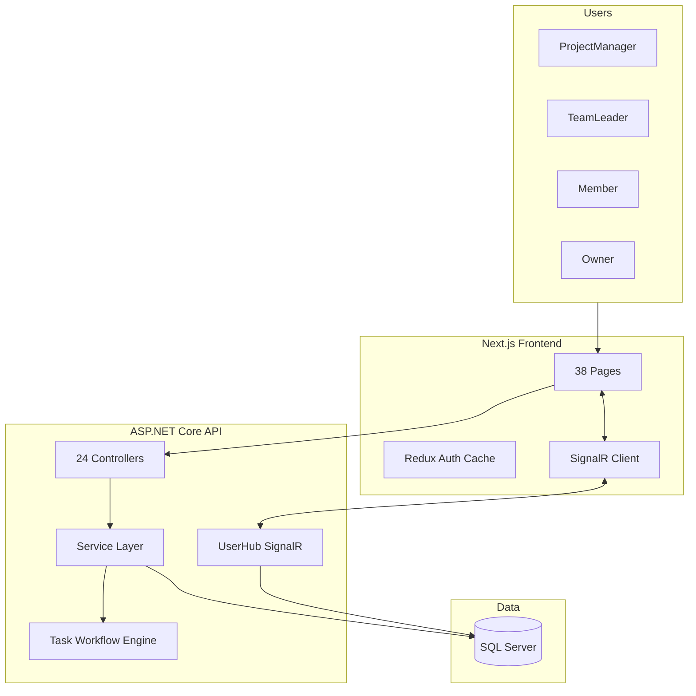
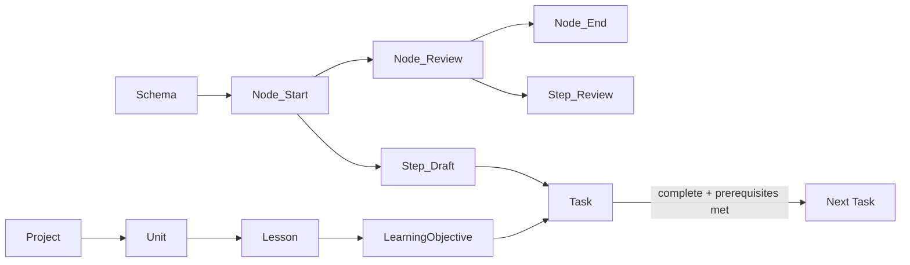
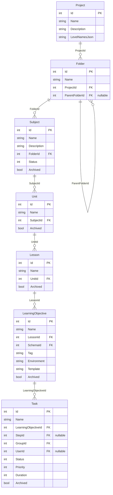
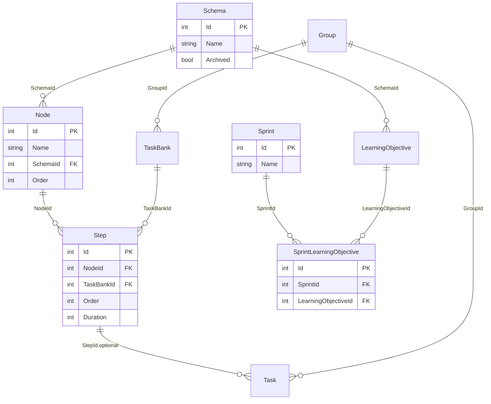

# Supporting notes
## Automated Task System (ATS) — Task Management System v1.0

| Field | Value |
|---|---|
| **Document type** | Consolidated engineering notes |
| **Date** | 2026-08-26 |
| **Status** | Historical / supporting |
| **Companion documents** | `docs/PROJECT_BRIEF.md`, `docs/PRD.md`, `docs/BRD.md`, `docs/SYSTEM_DESCRIPTION.md` |

This file groups former **repository-root** markdown. It is **not** a source of truth.

- Prefer `docs/PROJECT_BRIEF.md`, `docs/PRD.md`, `docs/BRD.md`, and `docs/SYSTEM_DESCRIPTION.md`.
- Prefer source code when these notes disagree (especially curriculum: the live tree is Academic Year → Curriculum Project → Term → Subject Group → Subject, not Year → Project → Folder).
- Screen counts, controller counts, and token lifetimes in the explanation prompt are stale.

---


---

## 1. Explanation prompt (former PROJECT_EXPLANATION_PROMPT.md)

# How to Explain This Project (AI Prompt Kit)

## What this project is (one sentence)

**Automated Task System (ATS)** is an internal full-stack platform for **Selah El-Telmeez** that manages educational content production: curriculum projects flow through configurable workflow schemas, tasks are tracked on Kanban/sheet views, sprints organize delivery, and HR leave/permission workflows run alongside real-time notifications.

---

## Copy-paste AI prompt

Use this as a system or user prompt when you want an AI to explain, document, demo-script, or answer questions about the project:

```text
You are explaining the "Automated Task System" (ATS) — a full-stack internal task and curriculum workflow platform.

## Purpose
ATS automates how educational content teams produce curriculum. Instead of ad-hoc task tracking, teams define reusable workflow schemas (directed graphs of nodes and steps). When work starts on a learning objective, the system auto-generates tasks and moves them through the pipeline. Managers track progress via Kanban boards, spreadsheets, dashboards, and reports. HR features (leave, permissions, work-from-home) are integrated with role-based approval chains and real-time alerts.

## Repository structure
- Backend API: AutomatedTaskSystem/ — ASP.NET Core 10 Web API
- Frontend: AutomatedTaskSystem.UI/client/ — Next.js 13 (Pages Router), React 18, TypeScript
- Tests: AutomatedTaskSystem.Test/ — xUnit integration tests with in-memory DB
- ~38 frontend screens documented in FRONTEND_SCREENS_LIST.md

## Tech stack
Backend: .NET 10, EF Core 10, SQL Server, JWT auth + HTTP-only refresh cookies, SignalR (/userhub), Swagger, MailKit (email), Cronos (scheduled jobs), Dapper (reports)
Frontend: Next.js 13, Redux Toolkit, Tailwind + SCSS + MUI, Chart.js/Recharts, SignalR client, react-toastify
Auth: 6-character user code login → JWT access token (2 days) + refresh token cookie (10 days)

## Core domain model (explain top-down)
1. Organization: Users belong to Groups, Teams, and Sections. Five roles: Owner, ProjectManager, SectionHead, TeamLeader, Member.
2. Curriculum: Year → Project → Unit → Lesson → Learning Objective
3. Workflow engine: Schema → Nodes (ordered graph with Next/Previous) → Steps → Tasks
4. Execution: Tasks are created per learning objective per step; completing a step can spawn tasks in downstream nodes when prerequisites are met
5. Sprints: Time-boxed delivery windows linked to learning objectives
6. HR: Leave requests, permissions, work-from-home — multi-level approval with email + SignalR notifications

## Main features to highlight
- Configurable workflow schema designer (nodes/steps, archive, duplicate, task bank)
- Task lifecycle: assign, priority, pause, flag, comments, rollback, work-time tracking, jump/skip/proceed
- Dual views: Kanban board and spreadsheet per project/sprint/learning objective
- Role-based dashboards and sidebar navigation
- Project lifecycle: Active / On Hold / Closed
- Sprint planning and sprint analytics
- Resource management (users, groups, sections) for admins
- Calendar-based HR approvals with opinion/approval chains
- Real-time notifications via SignalR (task assignments, pending leave counts)
- Reporting: project overview, summaries, chart pages, SSRS advanced reports
- Background workers: monthly DB operations, leave balance resets

## Architecture pattern
Controllers → Services → EF Core DataContext → SQL Server
DTOs for API contracts; ResponseService<T> wrapper for consistent API responses
Frontend: pages/ (file-based routes) → components/pageComponent/ + lib/API/ (fetch to backend at localhost:5238)
Redux for auth + shared caches; local state + API calls on most pages; SignalR context for live toasts

## Key files (for technical depth)
- Backend entry: AutomatedTaskSystem/Program.cs
- DI wiring: AutomatedTaskSystem/Builder/DependancyInjections.cs
- DB context: AutomatedTaskSystem/Data/DataContext.cs
- Task engine: AutomatedTaskSystem/Services/Task/TaskService.cs
- Auth: AutomatedTaskSystem/Services/Auth/ (TokenService, AuthService)
- Real-time: AutomatedTaskSystem/Hub/UserHub.cs
- Frontend shell: AutomatedTaskSystem.UI/client/src/pages/_app.tsx
- Auth gate: AutomatedTaskSystem.UI/client/src/components/auth/
- API client: AutomatedTaskSystem.UI/client/src/lib/API/
- Sidebar/roles: AutomatedTaskSystem.UI/client/src/components/sidebar/sidebar.tsx

## What makes it distinctive (not a generic todo app)
- Graph-based workflow engine with node prerequisites (not just linear statuses)
- Tasks are tied to curriculum entities (learning objectives), not free-floating tickets
- Combines production workflow + sprint planning + HR in one system
- Role hierarchy drives both UI visibility and approval workflows
- Real-time layer for operational awareness (pending approvals, assignments)

## Demo narrative (5-minute walkthrough)
1. Login with 6-digit code → role-based home dashboard
2. Open a Project → see units/lessons/learning objectives
3. Open Tasks → Kanban board showing tasks per workflow step
4. Click a task → comments, step navigation, complete/proceed
5. Show Schemas → how workflows are designed as node graphs
6. Show Sprints → time-boxed delivery on learning objectives
7. Show Calendar → leave/permission approval flow
8. Mention notifications arriving live via SignalR

When explaining, match depth to audience:
- Non-technical: focus on problem, workflow automation, roles, dashboards
- Technical: focus on schema graph engine, service layer, JWT+SignalR, EF Core model
- Portfolio: emphasize full-stack scope, real-time, workflow engine, 38 screens, integration tests

Do not describe it as a simple task manager or Trello clone — emphasize curriculum workflow automation.
```

---

## Visual aids to include when explaining

### High-level system diagram



### Workflow engine (the differentiator)



Each **Learning Objective** gets tasks auto-generated from a **Schema**. **Nodes** form a directed graph; **Steps** within nodes define granular work. Completing tasks propagates work to **Next** nodes only when all **Previous** node requirements are satisfied (`AutomatedTaskSystem/Models/Node.cs`, `AutomatedTaskSystem/Services/Task/TaskService.cs`).

---

## Fact sheet (keep these numbers handy)

| Item | Value |
|------|-------|
| Backend controllers | 24 |
| Frontend screens | 38 |
| User roles | 5 (Owner, ProjectManager, SectionHead, TeamLeader, Member) |
| Core DB entities | ~30 DbSets |
| API docs | Swagger at `/swagger` |
| Real-time hub | `/userhub` |
| Dev ports | API `:5238`, UI `:3000` |

---

## Prompt variations (short add-ons)

Append one of these to the main prompt depending on what you need:

- **README generation:** "Write a professional README with setup instructions, architecture overview, and feature list. Backend runs via `dotnet run` in AutomatedTaskSystem; frontend via `npm run dev` in AutomatedTaskSystem.UI/client."
- **Interview prep:** "Prepare 10 likely interview questions and strong answers about architecture decisions, the workflow engine, auth, and real-time notifications."
- **Pitch deck script:** "Write a 2-minute spoken pitch for a non-technical manager, then a 5-minute technical deep-dive."
- **Onboarding doc:** "Write a day-1 developer guide: where to start reading code, how auth works, how a task moves through the system end-to-end."
- **Feature comparison:** "Compare ATS to Jira/Asana/Trello and explain why a custom workflow engine was needed for curriculum production."

---

## What NOT to say (common mistakes)

- Do not call it "just a task manager" — the schema graph + learning objective binding is the core value.
- Do not oversimplify auth as "password login" — it uses a **6-character user code** with JWT + refresh cookies.
- Do not ignore HR — leave/permission/WFH is a major module with approval chains, email, and SignalR.
- Do not claim every endpoint is `[Authorize]` — authorization is selective; mention role-based UI gating on the frontend.

---

## Quick usage

1. Open this file and copy the block inside the **Copy-paste AI prompt** section.
2. Paste it as a system prompt or at the start of a chat with any AI assistant.
3. Append one of the **Prompt variations** add-ons for your specific goal (README, interview prep, pitch, onboarding, comparison).


---

## 2. Subject library labels (former STRUCTURE 1.md)

# Subject Library — Curriculum Hierarchy

An explanation of how the curriculum is organized, from the top level (Season) down to the actual Subject.

---

## The Hierarchy

The structure has 5 levels. Each level contains the one below it:

```
Season (academic season)
  └─ Program
       └─ Term
            └─ Family (a grouping of related subjects)
                 └─ Subject (the actual subject)
```

---

## What each level means

| Level | Represents | Key attributes |
|-------|-----------|----------------|
| **Season** | The academic season / year — the top of the tree. Everything else lives inside a season. | Academic year, start & end dates, archived flag |
| **Program** | A program offered within the season. | Name, code, archived flag |
| **Term** | A term or time window inside a program. | Name, code, start & end dates |
| **Family** | A subject family — a grouping of related subjects. | Name, code |
| **Subject** | The actual subject taught. This is the leaf of the tree. | Code, grade, language, publication status, production target |

---

## Notes

- **Publication starts at the Subject level only** — the higher levels (Season, Program, Term, Family) are organizational; a subject is what gets published.
- A **full path** through the hierarchy is: `Season → Program → Term → Family → Subject`. This complete path is what identifies a subject in context.
- Any level can be **archived** (hidden but retained), and archiving/deleting a level cascades to everything beneath it.


---

## 3. Frontend screens inventory (former FRONTEND_SCREENS_LIST.md) — stale count

# Frontend Screens Inventory

## Total Count: **38 Screens**

---

## 1. Home/Dashboard
- **Home** (`/`) - Dashboard with role-based views (Project Manager Dashboard, Team Leader Dashboard)

---

## 2. Tasks (7 screens)
- **Tasks List** (`/tasks`) - List of all projects/sprints for task management
- **Project Tasks** (`/tasks/[projectId]`) - Redirects to board or sheet view based on preference
- **Project Tasks Board** (`/tasks/[projectId]/board`) - Kanban board view for project tasks
- **Project Tasks Sheet** (`/tasks/[projectId]/sheet`) - Table/sheet view for project tasks
- **Sprint Tasks** (`/tasks/sprint/[sprintId]`) - Tasks for a specific sprint
- **Sprint Tasks Board** (`/tasks/sprint/[sprintId]/board`) - Kanban board view for sprint tasks
- **Sprint Tasks Sheet** (`/tasks/sprint/[sprintId]/sheet`) - Table/sheet view for sprint tasks

---

## 3. Projects (2 screens)
- **Projects List** (`/projects`) - List of all projects with tabs (Active, On Hold, Closed)
- **Project Details** (`/projects/[projectId]`) - Detailed view of a specific project

---

## 4. Resources (6 screens)
- **Resources Hub** (`/resources`) - Main resources page with links to Groups, Users, Sections
- **Users List** (`/resources/users`) - List of all users
- **User Details** (`/resources/users/[userId]`) - Detailed view of a specific user
- **Groups List** (`/resources/groups`) - List of all groups
- **Sections List** (`/resources/sections`) - List of all sections
- **Section Details** (`/resources/sections/[sectionId]`) - Detailed view of a specific section

---

## 5. Schemas (4 screens)
- **Schemas List** (`/schemas`) - List of all schemas
- **Schema Details** (`/schemas/[schemaId]`) - Detailed view of a specific schema
- **Archived Schemas** (`/schemas/archived`) - List of archived schemas
- **Task Bank** (`/schemas/task-bank`) - Task bank management

---

## 6. Sprints (5 screens)
- **Sprints List** (`/sprints`) - List of all sprints (Active and Archived tabs)
- **Sprint Details** (`/sprints/[sprintId]`) - Detailed view of a specific sprint
- **Learning Object Details** (`/sprints/[sprintId]/[learningObjectId]`) - Details of a learning object within a sprint
- **Learning Object Sheet** (`/sprints/[sprintId]/[learningObjectId]/sheet`) - Sheet view for learning object tasks
- **Learning Object Board** (`/sprints/[sprintId]/[learningObjectId]/board`) - Board view for learning object tasks

---

## 7. Reports (5 screens)
- **Project Overview** (`/project-overview`) - Overview of all projects with statistics
- **Project Overview Details** (`/project-overview/[projectId]`) - Detailed project overview report
- **Summaries List** (`/summaries`) - List of project summaries
- **Summary Details** (`/summaries/[projectId]`) - Detailed summary for a specific project
- **Advanced Report** (`/advancedReport`) - Advanced reporting dashboard (SSRS integration)

---

## 8. Calendar/Leaves (4 screens)
- **Calendar** (`/calendar`) - Main calendar with tabs for Vacancy, Permissions, and Work From Home requests
- **Vacancy Details** (`/calendar/vacancy/[calendarId]`) - Details of a specific leave/vacancy request
- **Permission Details** (`/calendar/permission/[calendarId]`) - Details of a specific permission request
- **Work From Home Details** (`/calendar/workFromHome/[calendarId]`) - Details of a specific work from home request

---

## 9. User Leaves (2 screens)
- **My Leaves** (`/myleave`) - User's personal leave management (Leaves, Permissions, Work From Home tabs)
- **Members Leaves** (`/members-leaves`) - HR view of all members' leave balances and statistics

---

## 10. User Tasks (1 screen)
- **User Tasks** (`/user-tasks`) - Overview of tasks assigned to users with task counts

---

## Summary by Category:
- **Home/Dashboard**: 1 screen
- **Tasks**: 7 screens
- **Projects**: 2 screens
- **Resources**: 6 screens
- **Schemas**: 4 screens
- **Sprints**: 5 screens
- **Reports**: 5 screens
- **Calendar/Leaves**: 4 screens
- **User Leaves**: 2 screens
- **User Tasks**: 1 screen

**Total: 38 Screens**


---

## 4. Subject to task ERD (former SUBJECT_TO_TASK_ERD.md) — pre-2026 folder model

# Subject → Task Hierarchy ERD

Entity relationship diagram for the curriculum chain from **Subject** down to **Task**, based on the active models in `AutomatedTaskSystem/Models` and `DataContext`.

## Hierarchy chain

```
Project
  └── Folder (self-referencing tree via ParentFolderId)
        └── Subject
              └── Unit
                    └── Lesson
                          └── LearningObjective
                                └── Task
```

All solid parent → child links are **1:N**.

| Level | Entity | Table | Parent FK | Cardinality |
|------:|--------|-------|-----------|-------------|
| 0 | Project | `FolderProjects` | — | 1 Project → N Folders |
| 1 | Folder | `Folders` | `ProjectId`, `ParentFolderId?` | Folder → N children / N Subjects |
| 2 | Subject | `Subjects` | `FolderId` | 1 Subject → N Units |
| 3 | Unit | `Units` | `SubjectId` | 1 Unit → N Lessons |
| 4 | Lesson | `Lessons` | `UnitId` | 1 Lesson → N LearningObjectives |
| 5 | LearningObjective | `LearningObjectives` | `LessonId` | 1 LO → N Tasks |
| 6 | Task | `Tasks` | `LearningObjectiveId` | — |

## ERD (primary hierarchy)



## Related entities (not part of the subject tree)

These attach to the hierarchy but are not ancestors of Subject:



| Relationship | Type | Notes |
|--------------|------|-------|
| LearningObjective → Schema | N:1 | Workflow template applied to the LO |
| Schema → Node → Step | 1:N | Process definition |
| Task → Step | N:1 optional | Task instance of a workflow step |
| Sprint ↔ LearningObjective | N:M | Via `SprintLearningObjective` |
| Task → Group | N:1 | Work group assigned to the task |

## Model sources

| Entity | File |
|--------|------|
| Project | [`AutomatedTaskSystem/Models/Project.cs`](AutomatedTaskSystem/Models/Project.cs) |
| Folder | [`AutomatedTaskSystem/Models/Folder.cs`](AutomatedTaskSystem/Models/Folder.cs) |
| Subject | [`AutomatedTaskSystem/Models/Subject.cs`](AutomatedTaskSystem/Models/Subject.cs) |
| Unit | [`AutomatedTaskSystem/Models/Unit.cs`](AutomatedTaskSystem/Models/Unit.cs) |
| Lesson | [`AutomatedTaskSystem/Models/Lesson.cs`](AutomatedTaskSystem/Models/Lesson.cs) |
| LearningObjective | [`AutomatedTaskSystem/Models/LearningObjective.cs`](AutomatedTaskSystem/Models/LearningObjective.cs) |
| Task | [`AutomatedTaskSystem/Models/Task.cs`](AutomatedTaskSystem/Models/Task.cs) |

DbContext: [`AutomatedTaskSystem/Data/DataContext.cs`](AutomatedTaskSystem/Data/DataContext.cs)


---

## 5. Task Logger (former TASK_LOGGER.md)

# Task Logger — Documentation

## What is Task Logger?

**Task Logger** is a read-only TMS screen that shows **member productivity** based on real tasks in the database (not manual entry).

It answers:

- Who worked on which tasks (LO / subject / task name)?
- How long did they take (actual minutes)?
- How does that compare to expected duration?
- How many points did each member earn?
- Who ranks highest (All Time / This Week / This Month)?

**UI route:** `/task-logger`  
**API prefix:** `/task-logger`  
**Source code:**

| Layer | Path |
|--------|------|
| Controller | `AutomatedTaskSystem/Controllers/TaskLoggerController.cs` |
| Service | `AutomatedTaskSystem/Services/TaskLogger/TaskLoggerService.cs` |
| SQL | `AutomatedTaskSystem/Services/TaskLogger/TaskLoggerSql.cs` |
| Frontend | `AutomatedTaskSystem.UI/client/src/components/taskLogger/` |

There is **no** “Add New Task” form. Everything is derived from existing TMS tables.

---

## What data the screen shows

### 1. Stats cards

| Card | Meaning |
|------|---------|
| **Total Tasks** | Count of tasks in the current filter window |
| **Total Time (min)** | Sum of actual minutes for those tasks |
| **Rollback Tasks** | Count where status = Rollback |
| **Total Points** | Sum of productivity points |

### 2. Member Rankings (by Points)

Aggregates **points per assigned member** (active users only), ordered highest first.

Time range for rankings (independent of the table date filters):

| Range | Meaning |
|-------|---------|
| **All Time** | No date bound on rankings |
| **This Week** | Monday of current week → today |
| **This Month** | 1st of current month → today |

### 3. Filters + Tasks Log table

| Column | Source |
|--------|--------|
| **Date** | Last Done/Rollback activity date, else task `CreatedAt` |
| **Member** | Assigned user name (`Users.Name`) — **non-archived only** |
| **LO Code** | `LearningObjectives.Tag` |
| **Subject** | Derived from `Subjects.Name` prefix (`ara_`, `eng_`, …) |
| **Task** | `TaskBank.Name`, else `Tasks.Name` |
| **Time** | Actual minutes (see scoring rules) |
| **Expected** | Expected minutes for scoring |
| **Points** | 3 / 2 / 1 / 0 (see below) |
| **Status** | Approved / Hold / Rollback |
| **Note** | Latest rollback clarification (if any) |

Default table window: **past month**, **5 rows per page**.

### 4. Duplicate LO tools (client-side)

Loads up to 500 filtered rows and highlights LO codes that appear more than once.

---

## Business rules

### Who is included?

- Task must be **not archived**
- Linked LO / Lesson / Unit / Subject must be **not archived**
- Assigned user must exist and be **`Users.Archived = 0`**
- Unassigned tasks and tasks assigned to archived users are **excluded**
- Work-time sums only include time logged by **non-archived** users

### Role scoping (same idea as Daily Report)

| Role | Sees |
|------|------|
| Owner / Project Manager | All matching tasks |
| Section Head | Tasks in groups under their sections |
| Team Leader | Tasks in their group |
| Member | Tasks assigned to them **or** in their group |

### Status mapping

| Report status | Condition |
|---------------|-----------|
| **Rollback** | `Tasks.Status = Rollback` **or** `IsRollback = 1` |
| **Approved** | `Tasks.Status = Done` |
| **Hold** | Everything else (Backlog, ToDo, Doing, …) |

### Time (ActualMinutes)

1. Prefer sum of `TaskWorkTimes.Duration` for that task (stored in **milliseconds**) ÷ `60000` → minutes  
2. Only work rows from **non-archived** users  
3. If that sum is 0 / missing → fall back to `Tasks.Duration`  
4. Rounded to whole minutes for comparison

### Expected minutes (ExpectedMinutes)

1. Prefer `Steps.Duration` if `> 0`  
2. Else `TaskBank.Duration` if `> 0`  
3. Else `Tasks.Duration` if `> 0`  
4. Else `0` (cannot score)

### Points

| Condition | Points |
|-----------|--------|
| No expected duration (`ExpectedMinutes <= 0`) | **0** |
| Before time (Actual **&lt;** Expected) | **3** |
| In time (Actual **=** Expected) | **2** |
| After time (Actual **&gt;** Expected) | **1** |

---

## API endpoints

| Method | Route | Purpose |
|--------|-------|---------|
| `GET` | `/task-logger/dashboard` | One call: paged rows + summary + rankings + lookups |
| `GET` | `/task-logger` | Paged rows only (export / duplicates) |
| `GET` | `/task-logger/lookups` | Member / task-name dropdown data |

### Query parameters

| Param | Used for |
|-------|----------|
| `from`, `to` | Table / summary date window |
| `search` | LO code or task name contains |
| `member`, `subject`, `status`, `taskName` | Exact filters |
| `rankingRange` | `all` \| `week` \| `month` |
| `page`, `pageSize` | Pagination (default 5, max 500) |

---

## Query architecture (high level)

```text
GET /task-logger/dashboard
├── Phase A: Light CTE → COUNT + page of TaskIds
├── Phase B: Enrich those TaskIds (notes + full row fields)
├── Summary: same Light CTE → aggregates
├── Rankings: Rankings CTE → SUM(Points) by Member
└── Lookups: light distinct members / task names
```

All reads use **Dapper + raw SQL** (not EF includes), similar to Daily Report.

---

## Core query explained (`LightBaseCte`)

This is the main building block for rows, summary, and (with a variant) rankings.

### 1) `ActivityDates` CTE

```sql
SELECT TaskId, MAX(TimeStamp) AS ReportDate
FROM TaskActivities
WHERE Type IN (@statusDone, @statusRollback, @rollbackActivity)
  AND TimeStamp >= @fromDate
  AND TimeStamp < DATEADD(DAY, 1, @toDate)
GROUP BY TaskId
```

**Purpose:** Find the latest “completion-like” activity per task inside the date window.

| Part | Meaning |
|------|---------|
| `Type IN (...)` | Only Done / Rollback activity types |
| `TimeStamp` range | Bound the scan to the report window (performance) |
| `MAX(TimeStamp)` | One report date per task |
| `GROUP BY TaskId` | One row per task |

### 2) `WorkTimes` CTE

```sql
SELECT twt.TaskId, SUM(twt.Duration) / 60000.0 AS ActualMinutes
FROM TaskWorkTimes twt
INNER JOIN Users wu ON wu.Id = twt.UserId AND wu.Archived = 0
GROUP BY twt.TaskId
```

**Purpose:** Actual work time in minutes, only from active users.

| Part | Meaning |
|------|---------|
| `SUM(Duration)` | Total logged work (milliseconds) |
| `/ 60000.0` | Convert ms → minutes |
| `wu.Archived = 0` | Ignore archived users’ work logs |

### 3) `BaseRows` CTE — joins

```text
Tasks t
  → Groups g
  → LearningObjectives lo
  → Lessons l
  → Units un
  → Subjects s
  → Users usr          (INNER, Archived = 0)
  → Steps / TaskBank   (LEFT)
  → ActivityDates      (LEFT)
  → WorkTimes          (LEFT)
```

| Join | Why |
|------|-----|
| Hierarchy to `Subjects` | Subject label + ensure LO path exists |
| `INNER JOIN Users … Archived = 0` | Only assigned, active members |
| `LEFT JOIN Steps/TaskBank` | Task name + expected duration when present |
| `LEFT JOIN ActivityDates` | Report date when activity exists |
| `LEFT JOIN WorkTimes` | Actual minutes when work was logged |

**Archive filters on content:**

```sql
WHERE t.Archived = 0 AND lo.Archived = 0 AND l.Archived = 0
  AND un.Archived = 0 AND s.Archived = 0
```

### 4) `BaseRows` — computed columns

#### ReportDate

```sql
CAST(COALESCE(ad.ReportDate, t.CreatedAt) AS date)
```

Use activity date if present; otherwise task creation date.

#### Subject

`CASE` on `Subjects.Name` prefixes (`ara_%` → Arabic, `eng_%` → English, …, else Other).

#### TaskName

```sql
COALESCE(NULLIF(tb.Name, ''), t.Name)
```

Prefer TaskBank name; fall back to task name.

#### ActualMinutes

```sql
ROUND(COALESCE(NULLIF(wt.ActualMinutes, 0), NULLIF(t.Duration, 0), 0), 0)
```

Work times first; else task duration; else 0.

#### ExpectedMinutes

```sql
COALESCE(NULLIF(st.Duration, 0), NULLIF(tb.Duration, 0), NULLIF(t.Duration, 0), 0)
```

Step duration first; else TaskBank; else task duration; else 0 (unscored).

#### Points

```sql
CASE
  WHEN ExpectedMinutes <= 0 THEN 0
  WHEN Actual < Expected THEN 3   -- before time
  WHEN Actual = Expected THEN 2   -- in time
  ELSE 1                          -- after time
END
```

#### Status

```sql
CASE
  WHEN t.Status = Rollback OR t.IsRollback = 1 THEN 'Rollback'
  WHEN t.Status = Done THEN 'Approved'
  ELSE 'Hold'
END
```

### 5) Injected placeholders

| Placeholder | Injected by C# |
|-------------|----------------|
| `{DATE_FILTER_BASE}` | `COALESCE(ad.ReportDate, t.CreatedAt)` between `@fromDate` and `@toDate` |
| `{ROLE_FILTER}` | Role-based `GroupId` / `UserId` restriction |

Example date filter:

```sql
AND COALESCE(ad.ReportDate, t.CreatedAt) >= @fromDate
AND COALESCE(ad.ReportDate, t.CreatedAt) < DATEADD(DAY, 1, @toDate)
```

(`DATEADD(DAY, 1, @toDate)` makes the end date inclusive for the whole day.)

---

## Two-phase paging (rows)

### Phase A — count + TaskIds

```sql
SET NOCOUNT ON;
WITH ... BaseRows AS (...),
Filtered AS (SELECT * FROM BaseRows WHERE ...filters...)
SELECT * INTO #TaskLoggerFiltered FROM Filtered;
SELECT COUNT(1) FROM #TaskLoggerFiltered;
SELECT TaskId
FROM #TaskLoggerFiltered
ORDER BY ReportDate DESC, TaskId DESC
OFFSET @offset ROWS FETCH NEXT @pageSize ROWS ONLY
```

| Step | Why |
|------|-----|
| Materialize into `#TaskLoggerFiltered` | SQL CTEs only apply to **one** statement; temp table lets us run COUNT + page together |
| `COUNT` | Total rows for pagination |
| `OFFSET / FETCH` | Current page of IDs only |

### Phase B — enrich page TaskIds (`EnrichRowsSql`)

Runs only for the current page (e.g. 5 IDs):

- Same time / points / subject logic  
- Adds **Notes** from latest rollback clarification (`ROW_NUMBER() … ORDER BY r.Id DESC`)

This avoids joining rollbacks for the entire filtered set just to show one page.

---

## Summary query

Same Light CTE + filters, then:

```sql
SELECT
  COUNT(1) AS TotalTasks,
  ISNULL(SUM(ActualMinutes), 0) AS TotalTimeMinutes,
  SUM(CASE WHEN [Status] = 'Rollback' THEN 1 ELSE 0 END) AS RollbackTasks,
  ISNULL(SUM(Points), 0) AS TotalPoints
FROM #TaskLoggerSummary
```

Feeds the four stats cards.

---

## Rankings query

Uses `RankingsBaseCte` (same points logic, fewer selected columns).

| `rankingRange` | Activity / date behavior |
|----------------|--------------------------|
| `all` | No date bound |
| `week` / `month` | Bound ActivityDates + report-date filter to that window |

Then:

```sql
SELECT TOP 5 Member, SUM(Points) AS Points
FROM Filtered
WHERE Member IS NOT NULL AND Member <> ''
GROUP BY Member
ORDER BY SUM(Points) DESC, Member
```

Only the **top 5** members are returned. Rank number (`1..5`) is assigned in C# after ordering.

---

## Lookups

| Query | Returns |
|-------|---------|
| Members | Distinct active assignee names in date window (role-scoped) |
| Task names | Distinct TaskBank/Task names |
| Subjects / Statuses | Static lists on the server |

---

## Data flow diagram

```text
                    ┌─────────────────────┐
                    │  TaskActivities     │──► ReportDate
                    │  TaskWorkTimes      │──► ActualMinutes
                    │  TaskBank / Tasks   │──► ExpectedMinutes
                    │  Users (active)     │──► Member
                    │  LO.Tag / Subjects  │──► LoCode / Subject
                    └─────────┬───────────┘
                              │
                              â–¼
                     Light CTE → BaseRows
                              │
          ┌───────────────────┼───────────────────┐
          â–¼                   â–¼                   â–¼
     Paged TaskIds        Summary stats      Member rankings
          │
          â–¼
   Enrich (Notes) → Table rows
```

---

## Important files to read when changing behavior

1. Scoring / joins → `TaskLoggerSql.cs`  
2. Role filter / ranking range / pagination → `TaskLoggerService.cs`  
3. HTTP contract → `TaskLoggerController.cs`  
4. UI filters / rankings / duplicates → `components/taskLogger/`


---

## 6. Sprints and projects analysis (former SPRINTS_PROJECTS_ANALYSIS.md)

# Sprints and Projects Analysis

## Project Analysis

### Project Purpose and Scope
- The Automated Task System (ATS) is a full-stack internal platform for curriculum production workflows, not a generic task tracker.
- It combines curriculum lifecycle management, workflow automation, sprint delivery, reporting, and HR approval processes in one system.
- The core domain connects `Year -> Project -> Unit -> Lesson -> Learning Objective` to workflow-driven task execution.

### Architecture Analysis
- Backend follows `Controllers -> Services -> DataContext` with standardized API response wrapping.
- Frontend is Next.js (Pages Router) with role-aware rendering and API-driven dashboards.
- Real-time updates are delivered through SignalR for operational events (task assignments and approval-related notifications).
- System design uses reusable workflow schemas with nodes and steps that generate and propagate tasks based on prerequisites.

### Feature and Capability Analysis
- Graph-based workflow execution is the main differentiator from linear status-driven systems.
- Project lifecycle management supports active, on-hold, and closed states with reporting surfaces.
- Sprint planning and analytics are integrated with project execution rather than handled in a separate tool.
- Role hierarchy affects both backend behavior and frontend visibility, creating consistent permission boundaries.

### Delivery Surface Analysis (Projects + Sprints UI)
- Project module includes list and details views for project-level monitoring and navigation.
- Sprint module includes sprint list/details and per-learning-object board/sheet task views.
- Reporting layer includes project overview, summaries, and advanced report pages for cross-project analysis.

## Sprint Analysis

### Sprint: Role-Based Home Page Dashboard

#### Goal Analysis
- Primary sprint outcome is role-specific home dashboards so users only see relevant data and actions.
- Scope includes both backend dashboard endpoints and frontend role-based rendering components.

#### Requirements Analysis
- Existing dashboards cover Owner/Coordinator and Team Leader roles.
- Missing parts identified: Section Head and Member dashboard APIs and UI components.
- Role mapping must be fully consistent across auth state, API authorization, and UI rendering.

#### Backlog and Effort Analysis
- Backend work focuses on creating new endpoints for Section Head and Member dashboards and validating role delivery from auth profile.
- Frontend work focuses on role routing in home page, new dashboard components, API integration methods, and loading/error states.
- Testing is explicitly split into manual role validation and integration checks for API/auth flow.

#### Risk Analysis
- Highest risks are incorrect role mapping and unavailable backend endpoints.
- Moderate risks include partial/missing dashboard data and user-facing performance degradation.
- Mitigation strategy centers on enum/value verification, mock data fallback, and robust loading/error UI.

#### Success Metrics Analysis
- All five roles should receive appropriate dashboards with zero unauthorized content exposure.
- Dashboard render time target is within two seconds.
- No dashboard-related console/runtime errors are expected at release quality.

### Sprint Analytics API Analysis

#### Endpoint and Contract
- `GET /sprints/{sprintId}/analytics/overview` is designed as a pre-aggregated analytics endpoint.
- Contract includes tags distribution, task summary, learning-objective summary, and sprint summary.
- Response envelope follows a shared `ResponseService<T>` shape with `error` and optional `message`.

#### Data Semantics
- `taskSummary` and `sprintSummary` provide status-based counts (`active`, `completed`, `rollback`, `flagged`, `notStarted`, `total`).
- `loSummary` captures completion progression for learning objectives.
- `tags` represent categorized learning-objective workload with visual metadata for chart rendering.

#### Frontend Consumption Analysis
- Frontend behavior depends on strict shape validity: loading state, error state, empty state, then chart rendering.
- The API is suitable for overview dashboards because it minimizes client-side aggregation cost.
- Contract clarity and status code coverage reduce ambiguity for both UI and test implementation.

#### Extracted Query (Actual Implementation) + Description

**HTTP Query (actual endpoint used in code):**

```http
GET /sprints/analytics/overview?sprintId={sprintId}&timePeriod={timePeriod}
```

**Query Parameters Description:**
- `sprintId` (required): the sprint identifier to calculate analytics for.
- `timePeriod` (optional): date filter for tag distribution where:
  - `1` = Today
  - `2` = Last Week
  - `3` = Last Month
  - `4` = All Time (default behavior)

**What this query returns:**
- `taskSummary`: unfiltered global task-status counts for the sprint.
- `tags`: grouped task counts by group/tag, filtered by optional time period.
- `loSummary`: unfiltered learning-objective completion/not-started/in-process counts.
- `sprintSummary`: currently same values as `taskSummary`.

**Core SQL Query (used for task summary in backend service):**

```sql
SELECT
    Completed = SUM(CASE WHEN t.Status = @done THEN 1 ELSE 0 END),
    Active = SUM(CASE WHEN t.Status IN (@todo, @doing) THEN 1 ELSE 0 END),
    RollbackCount = SUM(CASE WHEN t.IsRollback = 1 THEN 1 ELSE 0 END),
    Flagged = SUM(CASE WHEN t.Flagged = 1 THEN 1 ELSE 0 END)
FROM Tasks t
INNER JOIN LearningObjectives lo ON lo.Id = t.LearningObjectiveId AND lo.Archived = 0
INNER JOIN SprintLearningObjectives slo ON slo.LearningObjectiveId = lo.Id AND slo.SprintId = @sprintId
WHERE t.Archived = 0
  AND LOWER(ISNULL(lo.Name, '')) NOT LIKE '%old%';
```

**SQL Description:**
- Aggregates tasks linked to learning objectives in the selected sprint.
- Excludes archived tasks and archived learning objectives.
- Excludes legacy learning objectives whose names contain `"old"`.
- Produces the raw counts that are mapped to `Completed`, `Active`, `Rollback`, and `Flagged`.

## Sources Used for Extraction
- `PROJECT_EXPLANATION_PROMPT.md`
- `FRONTEND_SCREENS_LIST.md`
- `AutomatedTaskSystem.UI/client/SPRINT_Role_Based_Home_Page.md`
- `AutomatedTaskSystem.UI/client/SPRINT_OVERVIEW_API_REQUIREMENTS.md`


---

## 7. Sprint/project queries (former SPRINTS_PROJECTS_ALL_QUERIES.md)

# Sprints and Projects - All Queries

This file centralizes all sprint/project analytics queries found in the current implementation.

---

## 1) Sprint Overview API Query

**Type:** HTTP GET  
**Title:** Get Sprint Overview Analytics  
**Description:** Returns high-level sprint analytics including task summary, LO summary, tags distribution, and sprint summary.  
**Query:**

```http
GET /sprints/analytics/overview?sprintId={sprintId}&timePeriod={timePeriod}
```

**Parameters:**
- `sprintId` (required): Sprint ID.
- `timePeriod` (optional): `1=Today`, `2=Last Week`, `3=Last Month`, `4=All Time`.

---

## 2) Learning Objectives Progress API Query

**Type:** HTTP GET  
**Title:** Get Sprint Learning Objectives Progress  
**Description:** Returns progress/status per learning objective in a sprint, with optional time period and group filtering.  
**Query:**

```http
GET /sprints/analytics/learning-objectives-progress?sprintId={sprintId}&timePeriod={timePeriod}&group={groupId}
```

**Parameters:**
- `sprintId` (required): Sprint ID.
- `timePeriod` (optional): `1=Today`, `2=Last Week`, `3=Last Month`, `4=All Time`.
- `group` (optional): Group/Tag ID filter.

---

## 3) Learning Objectives Table API Query

**Type:** HTTP GET  
**Title:** Get Sprint Learning Objectives Table  
**Description:** Returns table-ready data for learning objectives in a sprint (name, dates, active tasks, phases, status, progress).  
**Query:**

```http
GET /sprints/analytics/learning-objectives-table?sprintId={sprintId}
```

**Parameters:**
- `sprintId` (required): Sprint ID.

---

## 4) SQL Query - Total Expected Tasks

**Type:** SQL  
**Title:** Count Expected Tasks from Schema Steps  
**Description:** Counts expected tasks for sprint learning objectives based on schema nodes/steps (excluding archived and "old" LOs).  
**Query:**

```sql
SELECT
    TotalExpectedTasks = COUNT(1)
FROM SprintLearningObjectives slo
INNER JOIN LearningObjectives lo ON lo.Id = slo.LearningObjectiveId AND lo.Archived = 0
INNER JOIN Nodes n ON n.SchemaId = lo.SchemaId AND n.Archived = 0
INNER JOIN Steps st ON st.NodeId = n.Id AND st.Archived = 0
WHERE slo.SprintId = @sprintId
  AND LOWER(ISNULL(lo.Name, '')) NOT LIKE '%old%';
```

---

## 5) SQL Query - Sprint Task Summary

**Type:** SQL  
**Title:** Aggregate Task Status Summary  
**Description:** Aggregates completed, active, rollback, and flagged task counts for the selected sprint.  
**Query:**

```sql
SELECT
    Completed = SUM(CASE WHEN t.Status = @done THEN 1 ELSE 0 END),
    Active = SUM(CASE WHEN t.Status IN (@todo, @doing) THEN 1 ELSE 0 END),
    RollbackCount = SUM(CASE WHEN t.IsRollback = 1 THEN 1 ELSE 0 END),
    Flagged = SUM(CASE WHEN t.Flagged = 1 THEN 1 ELSE 0 END)
FROM Tasks t
INNER JOIN LearningObjectives lo ON lo.Id = t.LearningObjectiveId AND lo.Archived = 0
INNER JOIN SprintLearningObjectives slo ON slo.LearningObjectiveId = lo.Id AND slo.SprintId = @sprintId
WHERE t.Archived = 0
  AND LOWER(ISNULL(lo.Name, '')) NOT LIKE '%old%';
```

---

## 6) SQL Query - Tags Distribution

**Type:** SQL  
**Title:** Group/Tag Distribution for Active Pipeline Tasks  
**Description:** Returns counts of non-done tasks by group/tag for sprint analytics charts, with optional date filtering.  
**Query:**

```sql
SELECT
    t.GroupId AS GroupId,
    g.Name AS [Label],
    g.ColorCode AS ColorCode,
    COUNT(1) AS [Value]
FROM Tasks t
INNER JOIN LearningObjectives lo ON lo.Id = t.LearningObjectiveId AND lo.Archived = 0
INNER JOIN SprintLearningObjectives slo ON slo.LearningObjectiveId = lo.Id AND slo.SprintId = @sprintId
INNER JOIN Groups g ON g.Id = t.GroupId
WHERE t.Archived = 0
  AND LOWER(ISNULL(lo.Name, '')) NOT LIKE '%old%'
  AND t.Status IN (@backlog, @todo, @doing)
  AND (@startDate IS NULL OR (t.CreatedAt >= @startDate AND t.CreatedAt <= @endDate))
GROUP BY t.GroupId, g.Name, g.ColorCode;
```

---

## 7) SQL Query - Learning Objectives Summary

**Type:** SQL  
**Title:** Categorize LOs into Completed / Not Started / In Process  
**Description:** Uses CTEs to calculate LO completion state for sprint-level summary charts.  
**Query:**

```sql
WITH SprintLOs AS (
    SELECT lo.Id, lo.SchemaId
    FROM SprintLearningObjectives slo
    INNER JOIN LearningObjectives lo ON lo.Id = slo.LearningObjectiveId
    WHERE slo.SprintId = @sprintId
      AND lo.Archived = 0
      AND LOWER(ISNULL(lo.Name, '')) NOT LIKE '%old%'
),
ExpectedSteps AS (
    SELECT sl.Id AS LearningObjectiveId, COUNT(1) AS ExpectedCount
    FROM SprintLOs sl
    INNER JOIN Nodes n ON n.SchemaId = sl.SchemaId AND n.Archived = 0
    INNER JOIN Steps s ON s.NodeId = n.Id AND s.Archived = 0
    GROUP BY sl.Id
),
TaskAgg AS (
    SELECT t.LearningObjectiveId,
           TotalTasks = COUNT(1),
           NonBacklogTasks = SUM(CASE WHEN t.Status <> @backlog THEN 1 ELSE 0 END),
           NotDoneTasks = SUM(CASE WHEN t.Status <> @done THEN 1 ELSE 0 END)
    FROM Tasks t
    INNER JOIN SprintLOs sl ON sl.Id = t.LearningObjectiveId
    WHERE t.Archived = 0
    GROUP BY t.LearningObjectiveId
)
SELECT
    Total = (SELECT COUNT(1) FROM SprintLOs),
    Completed = SUM(CASE WHEN ISNULL(ta.TotalTasks, 0) > 0 AND ISNULL(ta.NotDoneTasks, 0) = 0 THEN 1 ELSE 0 END),
    NotStarted = SUM(CASE
        WHEN ISNULL(ta.TotalTasks, 0) = 0 AND ISNULL(es.ExpectedCount, 0) > 0 THEN 1
        WHEN ISNULL(ta.TotalTasks, 0) > 0 AND ISNULL(ta.NonBacklogTasks, 0) = 0 THEN 1
        ELSE 0
    END)
FROM SprintLOs sl
LEFT JOIN ExpectedSteps es ON es.LearningObjectiveId = sl.Id
LEFT JOIN TaskAgg ta ON ta.LearningObjectiveId = sl.Id;
```

---

## 8) SQL Query - Sprint Name Lookup

**Type:** SQL  
**Title:** Get Sprint Name  
**Description:** Retrieves sprint name for table/report headers and validation checks.  
**Query:**

```sql
SELECT Name
FROM Sprints
WHERE Id = @sprintId;
```

---

## 9) SQL Query - Learning Objectives Table Rows

**Type:** SQL  
**Title:** Build LO Table Core Data  
**Description:** Produces the main rows for LO analytics table with expected/completed/active task counts per LO.  
**Query:**

```sql
WITH SprintLOs AS (
    SELECT lo.Id, lo.Name, lo.StartedAt, lo.DoneAt, lo.SchemaId
    FROM SprintLearningObjectives slo
    INNER JOIN LearningObjectives lo ON lo.Id = slo.LearningObjectiveId
    WHERE slo.SprintId = @sprintId
      AND lo.Archived = 0
      AND LOWER(ISNULL(lo.Name, '')) NOT LIKE '%old%'
),
ExpectedSteps AS (
    SELECT sl.Id AS LearningObjectiveId, COUNT(1) AS TotalExpectedTasks
    FROM SprintLOs sl
    INNER JOIN Nodes n ON n.SchemaId = sl.SchemaId AND n.Archived = 0
    INNER JOIN Steps s ON s.NodeId = n.Id AND s.Archived = 0
    GROUP BY sl.Id
),
TaskAgg AS (
    SELECT t.LearningObjectiveId,
           CompletedTasks = SUM(CASE WHEN t.Status = @done THEN 1 ELSE 0 END),
           ActiveTasks = SUM(CASE WHEN t.Status IN (@todo, @doing) THEN 1 ELSE 0 END)
    FROM Tasks t
    INNER JOIN SprintLOs sl ON sl.Id = t.LearningObjectiveId
    WHERE t.Archived = 0
    GROUP BY t.LearningObjectiveId
)
SELECT
    sl.Id,
    sl.Name,
    sl.StartedAt,
    sl.DoneAt,
    TotalExpectedTasks = ISNULL(es.TotalExpectedTasks, 0),
    CompletedTasks = ISNULL(ta.CompletedTasks, 0),
    ActiveTasks = ISNULL(ta.ActiveTasks, 0)
FROM SprintLOs sl
LEFT JOIN ExpectedSteps es ON es.LearningObjectiveId = sl.Id
LEFT JOIN TaskAgg ta ON ta.LearningObjectiveId = sl.Id
ORDER BY sl.Id;
```

---

## 10) SQL Query - Current Phases per Learning Objective

**Type:** SQL  
**Title:** Fetch Active Group Phases by LO  
**Description:** Returns active group phases (backlog/todo/doing) per learning objective for table phase indicators.  
**Query:**

```sql
SELECT
    lo.Id AS LearningObjectiveId,
    g.Name AS GroupName,
    g.ColorCode AS ColorCode
FROM SprintLearningObjectives slo
INNER JOIN LearningObjectives lo ON lo.Id = slo.LearningObjectiveId AND lo.Archived = 0
INNER JOIN Tasks t ON t.LearningObjectiveId = lo.Id AND t.Archived = 0
INNER JOIN Groups g ON g.Id = t.GroupId
WHERE slo.SprintId = @sprintId
  AND LOWER(ISNULL(lo.Name, '')) NOT LIKE '%old%'
  AND t.Status IN (@backlog, @todo, @doing);
```


---

## 8. Task assignment notification fix guide (former TASK_NOTIFICATION_FIX_GUIDE.md)

# Task Assignment Notification Fix Guide

## Investigation Summary

After thorough investigation, I found that the task assignment notification system is **already fully implemented** in the codebase. Both real-time SignalR notifications and persistent database notifications are correctly configured.

## Root Cause

The most likely issue is that the database migration for the `AdditionalData` column hasn't been applied yet. This column is required for proper task notification routing.

## Solution Steps

### 1. Apply Database Migration (CRITICAL)

Run the following command in the project directory to apply pending migrations:

```powershell
# Navigate to the backend project directory
cd AutomatedTaskSystem

# Apply all pending migrations
dotnet ef database update
```

This will apply the `PendingModelChanges` migration that adds the `AdditionalData` column to the Notifications table.

### 2. Verify the Implementation

The following components are already correctly implemented:

#### Backend (✅ Already Implemented)
- **NotificationService.NotifyUserOfTaskAssignment** (lines 130-195)
  - Sends SignalR "TaskAssigned" event
  - Creates persistent notification with `additionalData` containing `projectId`
  - Category: `WorkUpdates`, Type: `Task`

- **TaskService.AssignUser** (line 195)
  - Calls `NotifyUserOfTaskAssignment` after successful assignment

- **TaskService.createTask** (line 1693)
  - Calls `NotifyUserOfTaskAssignment` when task is created with assigned user

#### Frontend (✅ Already Implemented)
- **SignalR Handler** (connectionProvider.tsx, lines 273-289)
  - Listens for "TaskAssigned" events
  - Displays toast notification with clickable link

- **Notifications Page** (notifications/index.tsx, lines 145-158)
  - Properly routes task notifications using `additionalData.projectId`
  - Routes to: `/tasks/{projectId}/board?taskId={taskId}`

### 3. Testing the Notification System

After applying the migration, test the system:

1. **Test Real-time Notification (SignalR Toast)**:
   - User A logs in and stays on any page
   - User B (with appropriate permissions) assigns a task to User A
   - User A should see a toast notification appear with the task details
   - Clicking the toast should navigate to the task board

2. **Test Persistent Notification**:
   - User A logs in
   - User B assigns a task to User A (while User A is offline or online)
   - User A navigates to `/notifications` page
   - User A should see the task assignment notification in the "Work Updates" category
   - Clicking the notification should navigate to the task board with the task highlighted

### 4. Troubleshooting

If notifications still don't appear after applying the migration:

#### Check SignalR Connection
1. Open browser DevTools (F12)
2. Go to Console tab
3. Look for SignalR connection messages
4. Should see: "SignalR Connected" or similar

#### Check Database
Run this SQL query to verify notifications are being created:

```sql
SELECT TOP 10 * 
FROM Notifications 
WHERE Type = 'Task' 
ORDER BY CreatedAt DESC;
```

#### Check Backend Logs
Look for these log messages in the console:
- Success: No error messages
- Failure: "Error sending TaskAssigned notification for task {taskId} to user {userId}"
- Warning: "Task with id {taskId} not found when trying to notify user"

#### Verify User Authentication
- Ensure the user is logged in with a valid JWT token
- Check that the token contains the user's ID claim
- SignalR uses the JWT token for user identification

### 5. Expected Behavior

When a user is assigned to a task:

1. **Real-time (if user is online)**:
   - Toast notification appears in bottom-right corner
   - Shows: "New task assigned to you: {taskName} ({projectName}). Click to view."
   - Auto-close is disabled (user must manually close or click)
   - Clicking navigates to task board with task highlighted

2. **Persistent (always)**:
   - Notification saved to database
   - Appears in `/notifications` page under "Work Updates"
   - Shows: "Task '{taskName}' in project '{projectName}' has been assigned to you by {assignerName}."
   - Clicking navigates to task board with task highlighted
   - Marked as unread until user clicks it

## Files Modified (Already Complete)

No files need to be modified. The implementation is complete:

1. `AutomatedTaskSystem/Services/Notification/NotificationService.cs` - ✅ Complete
2. `AutomatedTaskSystem/Services/Task/TaskService.cs` - ✅ Complete
3. `AutomatedTaskSystem.UI/client/src/components/connection/connectionProvider.tsx` - ✅ Complete
4. `AutomatedTaskSystem.UI/client/src/pages/notifications/index.tsx` - ✅ Complete
5. `AutomatedTaskSystem/Models/Notification.cs` - ✅ Complete
6. `AutomatedTaskSystem/Migrations/20260120091035_PendingModelChanges.cs` - ✅ Created (needs to be applied)

## Conclusion

The notification system is fully implemented and should work correctly once the database migration is applied. If issues persist after applying the migration, follow the troubleshooting steps above.


